# 图像的基本表示

图像的张量表示: (高, 宽, 通道)

通道可以为1, 3, 4(2一般是灰度通道, 3一般是RGB或者HSV, 4一般是CMYK或者RGBA) , 每个通道都有一个高*宽的矩阵组成, 每个像素点上的值在0-255之间, 表示对应的灰度
 
*注意opencv在读取图像时默认的通道顺序是BGR*, 需要进行手动转换
```python
img = cv2.cvtColor(img, 
                   cv2.COLOR_BGR2RGB)  # 转换方式
```
一些基本理解:
1.   给图像加上某个数值, 就会让图像变亮
2.   给图像减去某个数值, 就会让图像变暗
3.   给图像乘上某个数值, 就会让图像变鲜艳(调整对比度)

# 卷积和卷积神经网络

## 卷积
二维矩阵的卷积表示其中一个矩阵在平面上旋转180度后, 与另一个矩阵求**点积**的结果(卷 = 旋转, 积 = 点积)

但是实际应用中, 我们不再进行旋转这一步, 直接进行点积操作

我们把旋转后的矩阵的值称为权重, 把该矩阵称为**过滤器**, 也叫做**卷积核**

由于图像像素矩阵往往很大, 我们不可能创造一个和原图像素矩阵一样大的权重矩阵来进行卷积运算. 因此我们往往创造一个较小的矩阵, 然后对像素矩阵进行扫描: 
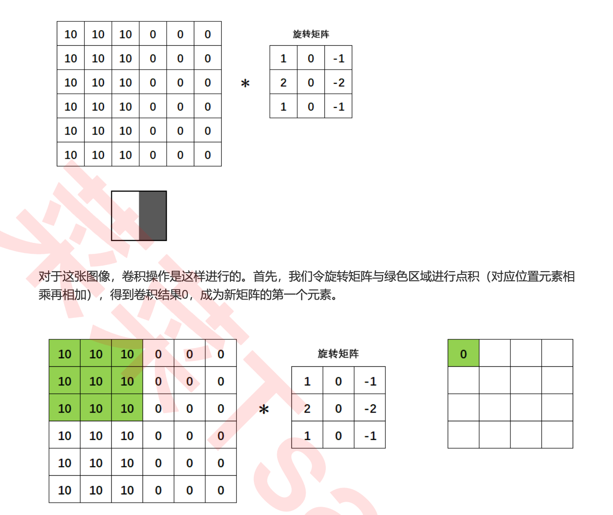
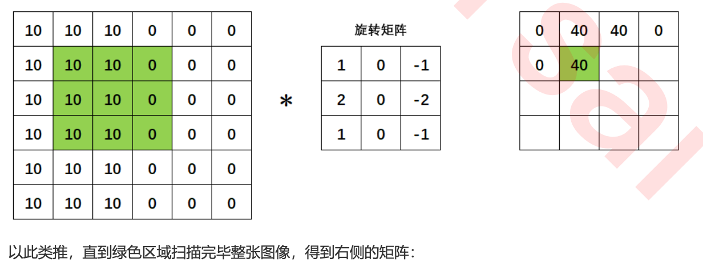
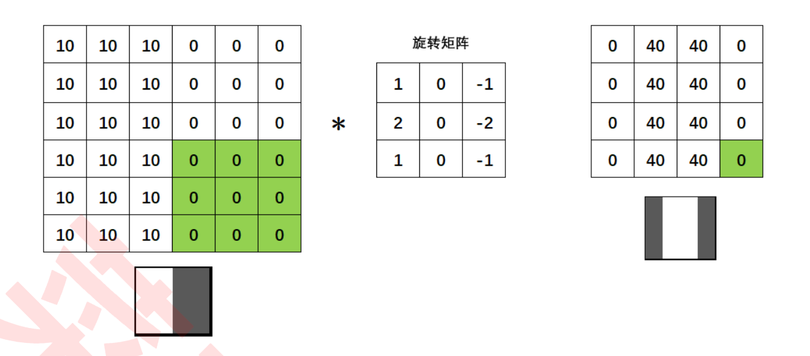

每个卷积核在原图上扫描的区域(即绿色区域)被称为**感受野**, 卷积核与感受野轮流点积得到的新矩阵被叫做**特征图**

使用不同的卷积核, 可以达到不同的效果, 比如边缘检测(索贝尔算子、拉普拉斯算子), 锐化, 模糊等

## 卷积神经网络
如何寻找效果更好的卷积核? 

深度学习的核心思想之一, 就是给算法训练目标, 让算法自己找最佳参数. 于是卷积神经网络就诞生了

### 参数共享
由于参数共享的性质, 卷积神经网络可以节省很大的参数量
*   **全连接DNN**: 假设图片尺寸为(600, 400), 输入DNN时需要将像素拉平至一维, 在输入层上就需要占用400*600=24w个神经元; 假设若干个隐藏层的神经元数为1w个, 则总共需要24亿个参数才能解决问题
*   **卷积神经网络CNN**: 无论图片多大, **卷积神经网络要求解的参数就是卷积核上的所有数字**. 假设卷积核的尺寸是5*5, 隐藏层的神经元个数为1w, 那么只需要求解25w个参数
  

### 稀疏交互
特征图上的一个神经元, 只和对应的感受野上极少数神经元有关. 因此, 神经元之间并不是全连接, 而是稀疏连接. 一般认为, 稀疏交互让CNN获得了提取更深特征的能力, 因为:
*   更符合数据的局部相关性假设
*   降低了过拟合风险

# 在pytorch中构筑卷积神经网络

## 卷积层
处理图像的普通卷积nn.Conv2d:

`torch.nn.Conv2d`(*in_channels, out_channels, kernel_size, stride=1, padding=0, dilation=1,
groups=1, bias=True, padding_mode='zeros'*)

*   **kernel_size**: 对于经典架构, 论文中所使用的尺寸就是最好的尺寸; 如果是自己的神经网络, 3*3几乎就是最好的选择
    *   卷积核几乎都是正方形
    *   卷积核的尺寸最好是奇数
    *   卷积核的尺寸往往比较小
*   **in_channels, out_channels**: in_channels输入卷积层的图像的通道数, out_channels是输出的特征图的数量
    *   卷积层的输入时图像时: 在一次扫描中, 假设输入了3通道的图片, 那么会有3个尺寸相同但数值不同的卷积核对3个通道分别进行扫描, 然后将得到的结果相加, 形成一张新的特征图. 因此一次扫描对应一张特征图, **输出特征图的个数实际上就是扫描的次数** (对同一个通道提供不同的卷积核来进行多次扫描是比较常见的操作)
    *   在这个过程中, 所需要的卷积核的数量 = in_channels * out_channels
    *   卷积层的输入是上层特征图时: **特征图会被当作通道对待, 一次扫描会扫描所有的特征图, 然后加和成一个新的特征图**. 在这个过程中, 也是一次扫描对应一个特征图
    *   无论在哪一层, 生成的特征图的数量都等于这一层的扫描次数, 也就是等于out_channels. **下一层卷积的in_channels就等于上一层卷积的out_channels**
*   **bias**: 可以理解为乘完权重之后加上的常数项. 在扫描完生成特征图之后加入特征图矩阵的每个元素中
*   **stride**: 卷积操作中的步长, 即每次卷积操作完之后向右移动或每次扫描完一整行后向下移动的像素数
    *   当步长=1时, 特征图的尺寸在扫描过后会发生改变. 假设卷积核的尺寸是$(K_H, K_W)$, 特征图的尺寸为$(H_{out}, W_{out})$, 那么有:
       $$H_{out} = H_{in} - K_H +1$$
       $$W_{out} = W_{in} - K_W +1$$
    *   设置步长后, 可以对生成的特征图进行降维(减少像素量), 设横向步长和纵向步长分别S[0]和S[1], 于是有:
       $$H_{out} = \frac{H_{in} - K_H}{S[0]} +1$$
       $$W_{out} = \frac{W_{in} - K_W}{S[1]} +1$$
*   **padding**: 四周填充的像素数(上下左右都会填充, 所以通道实际尺寸会增加2*padding)
     $$H_{out} = \frac{H_{in} - K_H +2*P}{S[0]} +1$$
       $$W_{out} = \frac{W_{in} - K_W+2*P}{S[1]} +1$$
    *   当有步长的时候, 往往容易出现扫描不充分/不完全的情况
    *   如果步长小于卷积核, 那么中间的区域就会反复被扫描, 但边缘的像素只会被捕捉到一两次, 导致提取信息不均衡, 中间重边缘轻
    *   在pytoch中, 一旦出现小数, 就向下取整, 因为没办法被扫描完全的部分会直接被丢弃

## 池化层

池化是一种简单粗暴的降维方式, 常见的有平均池化(`torch.nn.AvgPool2d`)和最大池化(`torch.nn.MaxPool2d`)
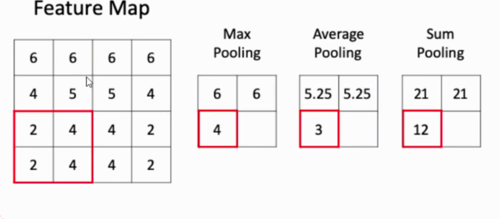
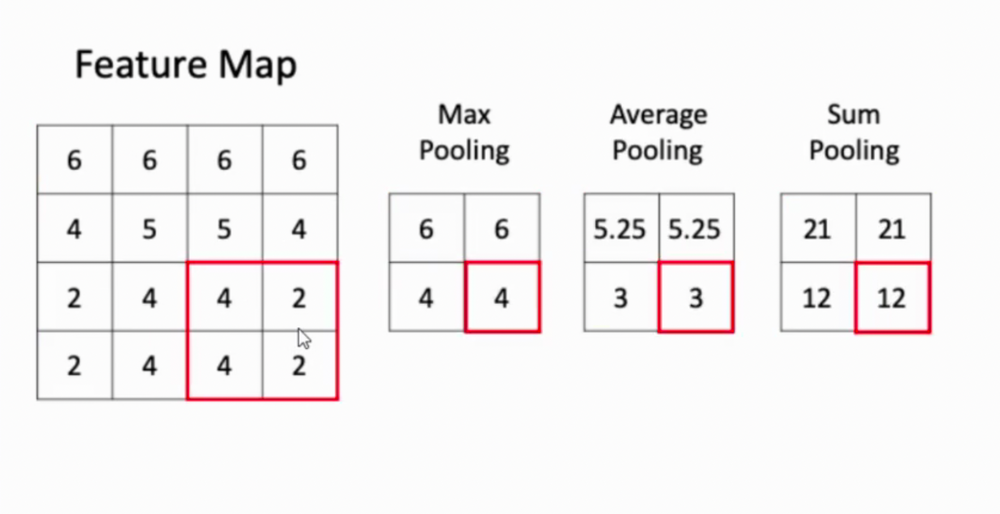

池化层也有核, 但只有尺寸, 没有值

默认步长 = 核尺寸, 这样可以避免重复扫描

池化后输出的特征图尺寸仍然满足:
$$H_{out} = \frac{H_{in} - K_H +2*P}{S[0]} +1$$
$$W_{out} = \frac{W_{in} - K_W +2*P}{S[1]} +1$$

比如, 对于(2, 2)的池化层来说, 可以使行列数量都减半, 也就是使总像素数量减少3/4, 是非常有效的降维方式

由于我们只关心池化后的输出的图的尺寸, 因此也可以使用自适应池化层, 只需要输入output_size即可

`torch.nn.AdaptiveMaxPool2d(output_size)`
`torch.nn.AdaptiveAvgPool2d(output_size)`

池化层的其他特点:
1.   提供非线性变化. 卷积层本质还是线性变化, 所以通常会在卷积层的后面增加激活层, 使用非线性激活函数
2.   有一定的平移不变性
3.   池化层的所有参数都是超参数, 没有任何可以学习的参数, 这既是优点(增加池化层不会增加参数量), 也是致命问题(池化层不会随着算法一起进步)
4.   对不同特征的特征图安相同的规律进行一次性降维, 必然引起大规模的信息损失

## BatchNorm2d, Droupout
`nn.BatchNorm2d`*(num_features, eps=1e-05, momentum=0.1, affine=True, track_running_stats=True)*

**BatchNorm2d**起到的是归一化的作用. 当出现在卷积网络前后时, BatchNorm2d所需要输入的是上一层输出的特征图的数量


`torch.nn.Droupout2d`*(p=0.5, inplace=False)*

**Droupout**指的是在训练过程中, 以概率p随机沉默一部分神经元, 以此减少过拟合可能性. 在卷积中, **Droupout不会以神经元为单位, 而是以特征图为单位进行沉默**, 所以不要使用太大的p,否则容易陷入欠拟合.

这两个层在训练和测试的时候起作用的方式不太一样, 使用时一定要区分训练和测试的情况


# 经典架构
| 网络                          | 架构特征                                                                                                               | 创新点                                                                                                                     |
|-------------------------------|------------------------------------------------------------------------------------------------------------------------|----------------------------------------------------------------------------------------------------------------------------|
| **LeNet-5**                   | - 由2个卷积层、2个池化层（当时多采用平均池化）和若干全连接层构成<br>- 主要用于手写数字识别                                  | - 首次提出卷积神经网络架构<br>- 利用局部感受野和权重共享实现特征提取                                                          |
| **AlexNet**                   | - 5个卷积层 + 3个全连接层<br>- 采用 ReLU 激活函数、重叠池化和局部响应归一化（LRN）<br>- 使用 GPU 并行加速训练           | - 利用 ReLU 加速收敛<br>- 引入 Dropout 进行正则化<br>- 数据增强和多 GPU 训练推动了深度网络的发展                             |
| **VGGNet**                    | - 采用堆叠多个 3×3 卷积层与 2×2 最大池化层构建深层网络<br>- 网络结构统一、层次简单                                       | - 通过堆叠小卷积核获得大感受野<br>- 强调网络深度对性能的提升，推动了深层网络设计的趋势                                       |
| **NiN (Network in Network)**  | - 在每个卷积层后嵌入小型多层感知机（mlpconv 层），对局部区域进行更复杂的非线性映射<br>- 使用全局平均池化代替全连接层      | - 引入“Network in Network”理念，增强局部特征的非线性表达能力<br>- 全局平均池化减少参数并缓解过拟合问题                     |
| **GoogLeNet**                 | - 利用 Inception 模块（将 1×1、3×3、5×5 卷积和池化并行组合）构建网络<br>- 网络较深（约 22 层），参数量控制较好              | - 创新性设计 Inception 模块，通过多尺度卷积捕捉丰富特征<br>- 使用 1×1 卷积进行降维，降低计算量<br>- 引入辅助分类器改善梯度传播和正则化效果 |

## LeNet5
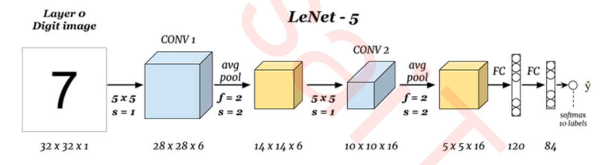

*   共6个层: 2个卷积层+2个平均池化层+2个全连接层
*   每个卷积层和全连接层后都适用激活函数tanh或sigmoid
*   **输入->(卷积+池化)->(卷积+池化)->(线性x2)->输出**

```python
import torch
from torch import nn
from torch.nn import functional as F

data = torch.ones(size=(10,1,32,32))  #(sample_num, 通道, 高, 宽)

class Model(nn.Module):
    def __init__(self):
        super().__init__()
        self.conv1 = nn.Conv2d(1,6,5)
        self.pool1 = nn.AvgPool2d(kernel_size=2,stride=2)
        self.conv2 = nn.Conv2d(6,16,5)
        self.pool2 = nn.AvgPool2d(kernel_size=2,stride=2)
        self.fc1 = nn.Linear(16*5*5,120) #这里的上层输入是图像中的全部像素 self.fc2 = nn.Linear(120,84)

    def forward(self,x):
        x = F.tanh(self.conv1(x))
        x = self.pool1(x)
        x = F.tanh(self.conv2(x))
        x = self.pool2(x)
        x = x.view(-1,16*5*5) #需要将数据的特征部分“拉平”才能够进入FC层 
        x = F.tanh(self.fc1(x))
        output = F.softmax(self.fc2(x),dim=1)  #(sample, feature)

net = Model()

net(data)


#卷积网络的一大特点是:改变输入数据的尺寸，整个网络就会开始花式报错 
#你可以试试将数据32*32的结构修改至28*28
#安装torchinfo库，查看网络结构 

!pip install torchinfo
from torchinfo import summary
net = Model()
summary(net, input_size=(10, 1, 32, 32))
```

## AlexNet
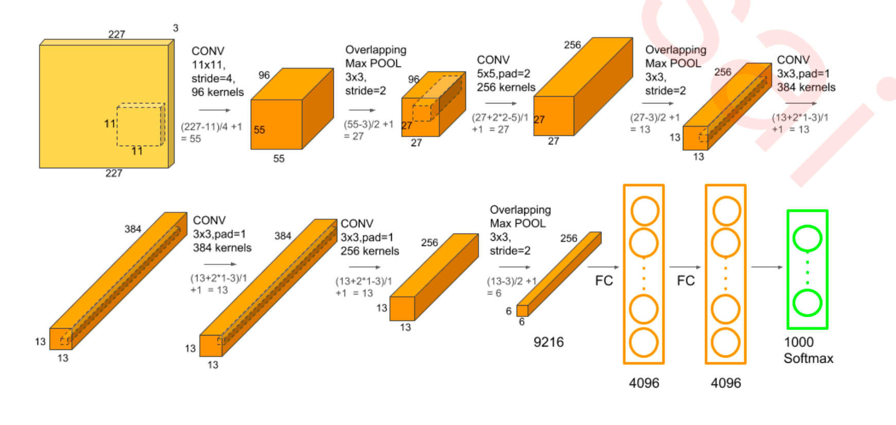

*   共11层: 5个卷积层, 3个池化层, 1个隐藏全连接层, 1个全连接输出层
*   在全连接层的前后使用了Dropout层(图中未表示)
*   **输入->(卷积+池化)->(卷积+池化)->(卷积x3+池化)->(线性x3)->输出**

与LeNet5相比, AlexNet的主要改进有:
1.   **卷积核更小, 网络更深, 通道数更多**
     *   小卷积核一定要搭配大通道来使用, 才能尽可能多地提取信息
     *   小卷积核会使得特征图尺寸下降更慢, 从而允许更深的网络. 图像天生就适合用更深的网络来提取信息
2.   使用ReLU激活函数

| 激活函数  | 输出范围   | 具体函数                                | 是否有梯度消失问题       | 是否以 0 为中心 | 计算效率 | 常见用途                                     |
|-----------|------------|-----------------------------------------|--------------------------|----------------|----------|---------------------------------------------|
| **ReLU**  | \[0, +∞\]  | $f(x) = \max(0, x)$                  | 无（但有死神经元问题）   | 否             | 高       | 深度神经网络的默认激活函数                    |
| **Sigmoid** | \[0, 1\]   | $f(x) = \frac{1}{1 + e^{-x}}$        | 有                       | 否             | 低       | 二分类问题，早期神经网络                     |
| **Tanh**  | \[-1, 1\]  | $f(x) = \tanh(x) = \frac{e^x - e^{-x}}{e^x + e^{-x}}$ | 有 | 是 | 中 | 需要平滑过渡且对负值敏感的场景 |
3.   使用Dropout层用来控制过拟合
4.   引入各种图像增强技术来扩大数据集, 进一步控制过拟合
5.   使用GPU来进行训练
   
```python

import torch
from torch import nn
from torch.nn import functional as F
data = torch.ones(size=(10,3,227,227)) #假设图像的尺寸为227x227
class Model(nn.Module):
    def __init__(self):
        super().__init__()
        #大卷积核、较大的步长, 快速降低图片尺寸; 较多的通道弥补降低图片尺寸的信息损失
        self.conv1 = nn.Conv2d(1,96,kernel_size=11, stride=4) 
        self.pool1 = nn.MaxPool2d(kernel_size=3,stride=2)

        #卷积核、步长恢复正常大小，进一步扩大通道
        self.conv2 = nn.Conv2d(96,256,kernel_size=5, padding=2)    #增加padding, 不让图片尺寸缩小
        self.pool2 = nn.MaxPool2d(kernel_size=3,stride=2)

        #连续的卷积层，疯狂提取特征
        self.conv3 = nn.Conv2d(256,384,kernel_size=3,padding=1) 
        self.conv4 = nn.Conv2d(384,384,kernel_size=3,padding=1) 
        self.conv5 = nn.Conv2d(384,256,kernel_size=3,padding=1) 
        self.pool3 = nn.MaxPool2d(kernel_size=3,stride=2)

        #全连接层
        self.fc1 = nn.Linear(256*6*6,4096) #这里的上层输入是图像中的全部像素 
        self.fc2 = nn.Linear(4096,4096)
        self.fc3 = nn.Linear(4096,1000) #输出ImageNet的一千个类别

   def forward(self,x):
        x = F.relu(self.conv1(x))
        x = self.pool1(x)

        x = F.relu(self.conv2(x))
        x = self.pool2(x)

        x = F.relu(self.conv3(x))
        x = F.relu(self.conv4(x))
        x = F.relu(self.conv5(x))
        x = self.pool3(x)

        x = x.view(-1,256*6*6) #需要将数据的特征部分“拉平”才能够进入FC层
        x = F.relu(F.dropout(self.fc1(x),0.5)) #dropout:随机让50%的权重为0 
        x = F.relu(F.dropout(self.fc2(x),0.5))
        output = F.softmax(self.fc3(x),dim=1)

net = Model()
net(data)
```


## VGGNet
基于重复架构, VGGNet的核心思想是**使用多个连续且保持特征图尺寸不变的卷积层来增加深度**, 以增加算法的学习能力

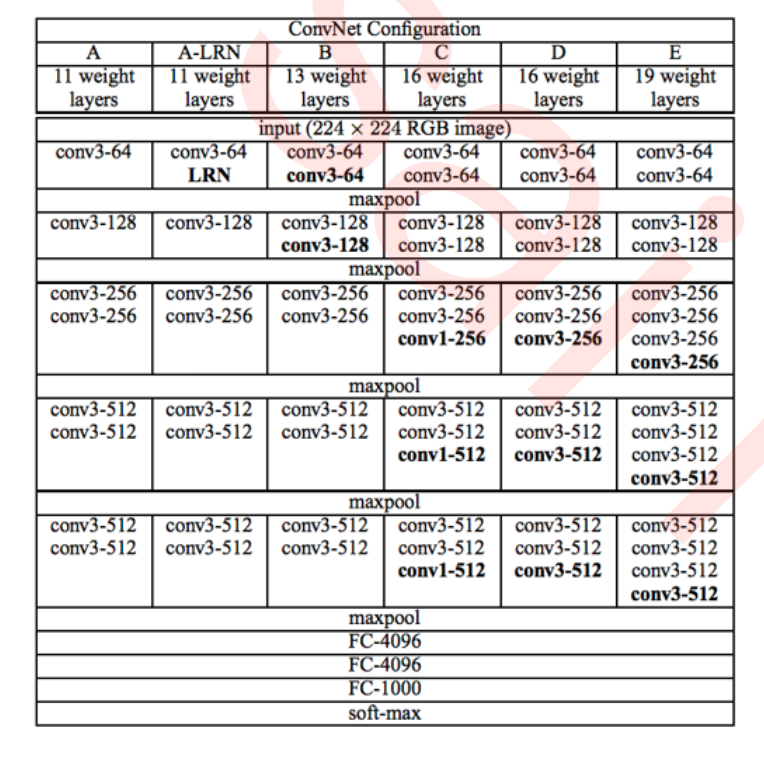

*   n x 卷积+池化 = 1block

```python
import torch
from torch import nn
from torch.nn import functional as F
from torchinfo import summary
class VGG16(nn.Module):
    def __init__(self):
        super().__init__()
        #block1
        self.conv1 = nn.Conv2d(3,64,3,padding=1)
        self.conv2 = nn.Conv2d(64,64,3,padding=1)
        self.pool1 = nn.MaxPool2d(2)
        #block2
        self.conv3 = nn.Conv2d(64,128,3,padding=1)
        self.conv4 = nn.Conv2d(128,128,3,padding=1)
        self.pool2 = nn.MaxPool2d(2)
        #block3
        self.conv5 = nn.Conv2d(128,256,3,padding=1)
        self.conv6 = nn.Conv2d(256,256,3,padding=1)
        self.conv7 = nn.Conv2d(256,256,3,padding=1)
        self.pool3 = nn.MaxPool2d(2)
        #block4
        self.conv8 = nn.Conv2d(256,512,3,padding=1)
        self.conv9 = nn.Conv2d(512,512,3,padding=1)
        self.conv10 = nn.Conv2d(512,512,3,padding=1)
        self.pool4 = nn.MaxPool2d(2)
        #block5
        self.conv11 = nn.Conv2d(512,512,3,padding=1)
        self.conv12 = nn.Conv2d(512,512,3,padding=1)

        self.conv13 = nn.Conv2d(512,512,3,padding=1)
        self.pool5 = nn.MaxPool2d(2)
        
        #FC层
        self.linear1 = nn.Linear(512*7*7,4096) 
        self.linear2 = nn.Linear(4096,4096) 
        self.linear3 = nn.Linear(4096,10)

    def forward(self,x):
        x = F.relu(self.conv1(x))
        x = self.pool1(F.relu(self.conv2(x)))
        x = F.relu(self.conv3(x))
        x = self.pool2(F.relu(self.conv4(x)))
        x = F.relu(self.conv5(x))
        x = F.relu(self.conv6(x))
        x = self.pool3(F.relu(self.conv7(x)))
        x = F.relu(self.conv8(x))
        x = F.relu(self.conv9(x))
        x = self.pool4(F.relu(self.conv10(x)))
        x = F.relu(self.conv11(x))
        x = F.relu(self.conv12(x))
        x = self.pool5(F.relu(self.conv13(x)))

        x = x.view(-1, 512*7*7)

        x = F.relu(self.linear1(F.dropout(x,p=0.5)))
        x = F.relu(self.linear2(F.dropout(x,p=0.5)))
        output = F.softmax(self.linear3(x),dim=1)
        return output

vgg = VGG16()

summary(vgg, input_size=(10, 3, 224, 224),device="cpu")
```

## NiN
NiN没有使用全连接层, 虽然参数量没有减少, 但是最大的贡献是让人们意识到1x1卷积层的可能用途

```python
import torch
from torch import nn
from torchinfo import summary
data = torch.ones(size=(10,3,32,32))

class NiN(nn.Module):
    def __init__(self):
        super().__init__()
        self.block1 =nn.Sequential(nn.Conv2d(3,192,5,padding=2),nn.ReLU(inplace=True)
            ,nn.Conv2d(192,160,1),nn.ReLU(inplace=True)
            ,nn.Conv2d(160,96,1),nn.ReLU(inplace=True)
            ,nn.MaxPool2d(3,stride=2)
            ,nn.Dropout(0.25)
)
#在原论文中并没有标明dropout的p为多少，一般来说，用于卷积层的dropout上的p值都会较 小，因此设置了0.25
        self.block2 =nn.Sequential(nn.Conv2d(96,192,5,padding=2),nn.ReLU(inplace=True)
            ,nn.Conv2d(192,192,1),nn.ReLU(inplace=True)
            ,nn.Conv2d(192,192,1),nn.ReLU(inplace=True)
            ,nn.MaxPool2d(3,stride=2)
            ,nn.Dropout(0.25)
)
        self.block3 =nn.Sequential(nn.Conv2d(192,192,3,padding=1),nn.ReLU(inplace=True)
            ,nn.Conv2d(192,192,1),nn.ReLU(inplace=True)
            ,nn.Conv2d(192,10,1),nn.ReLU(inplace=True)
            ,nn.AvgPool2d(7,stride=1)
            ,nn.Softmax(dim=1)
)
    def forward(self,x):
        output = self.block3(self.block2(self.block1(x)))
        return output
```

## GoogLeNet
GPU更擅长计算稠密连接的数据(在相同参数量/连接数下,**稠密的结构比稀疏的结构计算更快**)

然而稠密的数据往往意味着更大的参数量, 会使得计算速度变慢

此时需要进行权衡:
*   稠密结构的学习能力更强, 但会因为参数量过于巨大而难以训练。
*   稀疏结构的参数量少, 但是学习能力会变得不稳定, 并且不能很好地利用现有计算资源


GoogLeNet的主要思路: **使用普通卷积、池化层这些稠密元素组成的块去无限逼近一个稀疏框架, 从而构造一种参数量与稀疏网络相似的稠密网络**

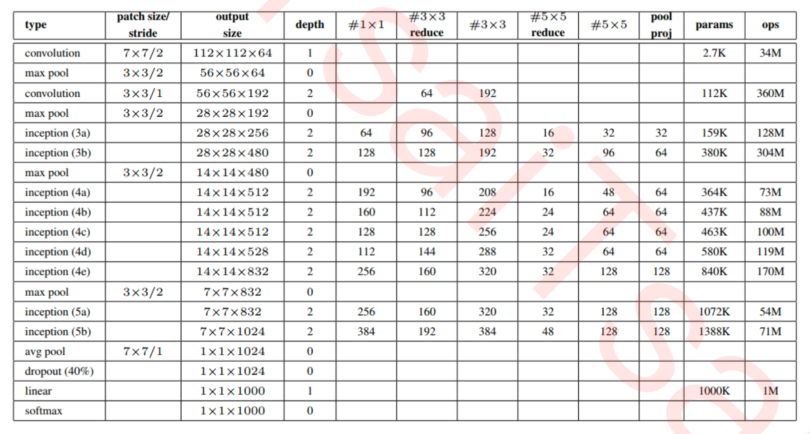

### InceptionV1

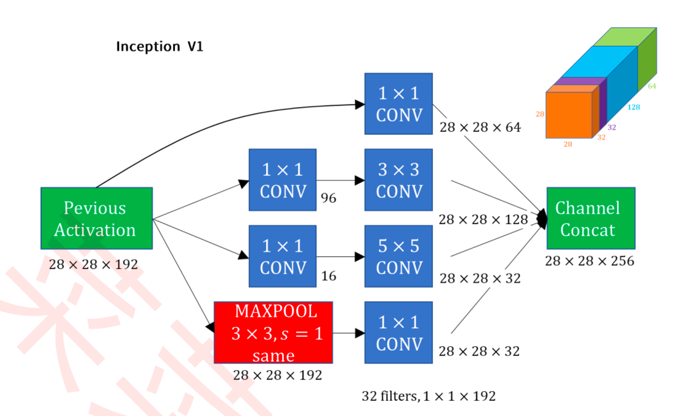

Inception架构的优点: 
1.   同时使用多种卷积核, 以确保各种类型和层次的信息都被提取出来
2.   并联的卷积池化层计算效率更高
3.   大量使用1x1卷积核来整合信息, 既实现了信息聚类又大规模降低了参数量


Inception架构出现在架构的后半段效果更好, 在Inception之前可以使用一些传统的卷积层

### 辅助分类器
在inception4a和inception4d之后, 分别接有一个辅助分类器, 以构成单独的较浅的网络. 

辅助分类器的作用主要是**将位于中间的inception结果单独导出, 并让两个辅助分类器和最终的分类器一共输出三个softmax结构、依次计算三个损失函数**, 并加权得到最终的损失

这有点类似于集成, **整个GoogLeNet实际上集成了两个浅层网络和一个深层网络的结果**

辅助分类器的结构: 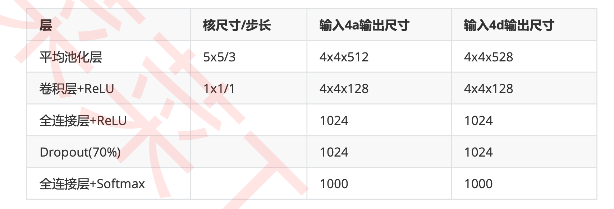


## ResNet

**退化**: 网络深度加深, 精度却在降低的现象

**退化现象并不是过拟合造成的**, 因为更深的网络在训练集上的精度也在降低


残差网络的基本思想: **假设增加深度用的最优结构就是恒等函数, 利用恒等函数的性质, 将用于加深网络深度的结构向更容易拟合和训练的方向设计**. 也就是说, 假设某个层是最优的状态, 那么这个层的性质应该非常接近于恒等函数的效果

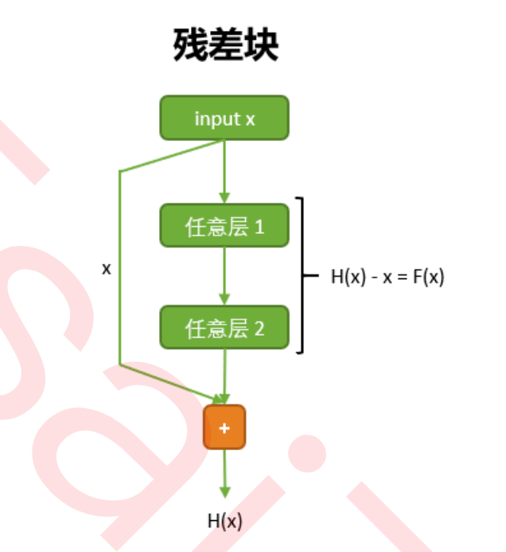

残差单元几乎实现了0负担(没有增加什么参数量)增加深度, 同时还可以大幅加速训练和运算速度

为了让跳跃连接过来的原始x与经过残差单元卷积层输出的特征图F(x)能相加, 必须保证**二者尺寸和特征图数量一致**
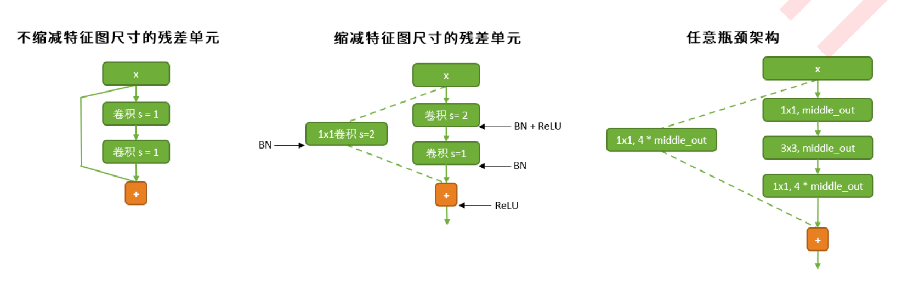

瓶颈结构中的**跳跃连接上一定是有1x1卷积核**来同步进行尺寸和特征图数量的改变


# 自己搭建卷积神经网络
模型评估三角: **效果, 效率, 可解释性**

“**小卷积核、多通道、更深层**”被证明是有效的

## 网络的深度
更深的网络会展现出更强大的学习能力

但可能碰到的问题是:
1.   输入图像的尺寸会限制深度的选择
     *   **卷积层和池化层都能快速地降低特征图的尺寸**. 以224x224尺寸为例, 只要池化层和步长为2的卷积层出现5次, 特征图的尺寸就会变成7x7, 不再具备追求更深网络的空间
     *   我们只能依赖卷积层来控制特征图尺寸缩小的速度. 卷积核越大, 生成的特征图尺寸越小. **因此为了深度, 卷积核最好选择小尺寸. 但对于小卷积核, padding就无法被设置得太大(padding参数要小于核尺寸的一半)**
     *   为了增加深度, 常见处理思路有:
         *   **递减架构**: **不使用池化层**, 利用padding核卷积核搭配, 使每经过一次卷积层, 就缩小几个像素
         *   **重复架构(计算效率更高、鲁棒性更好)**: 利用padding核卷积核搭配, 使**每次经过卷积层的尺寸不变**, 利用池化层来缩小特征图


## 感受野

**感受野**: 每个神经元节点都对应着**输入图像**上的某个区域, 且该神经元仅受这个区域中的图像内容的影响, 那么这个区域称为神经元的感受野

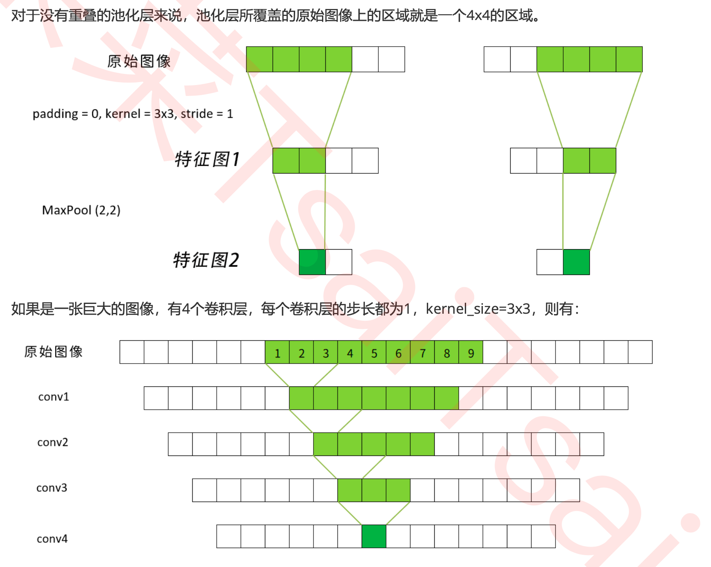

*   随着深度的加深, 神经元上的感受野会越来越大, 这意味着单个神经元上所携带的原始数据的信息会越来越多
*   由于卷积神经网络是稀疏交互的, 所以在被输入到FC层之前, 感受野越大越好
*   较大的感受野意味着较好的模型效果, 但稍微增加一些感受野的尺寸, 并不能对整个模型的效果带来巨大的改变

**感受野的性质:**
1.   **深度越大, 感受野越大**
2.   **池化层放大感受野的效率更高**
     *   递减架构: 在4个卷积层后, 图像尺寸22x22->14x14, 感受野尺寸为9x9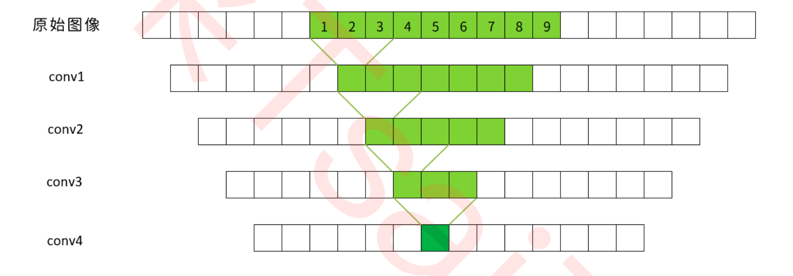
     *   重复架构: 在3个卷积层+1个池化层+1个卷积后, 特征图22x22->11x11, 感受野尺寸为12x12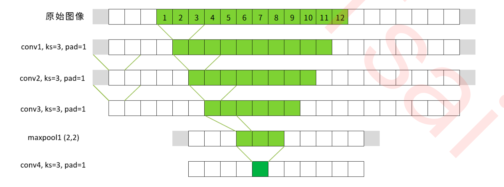
     *   在两种架构中, 只要卷积核的尺寸保持3x3, **那每经过一个卷积层, 感受野的尺寸实际上只会增加2. 但池化层在将特征图尺寸减半的同时, 却能够将感受野的宽和高都扩大一倍**. 池化层的存在令重复架构放大感受野的效率更高, 这让重复架构更有优势
3.   **感受野的尺寸没有上限**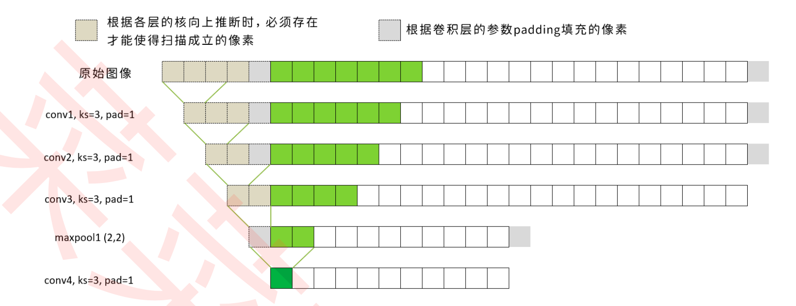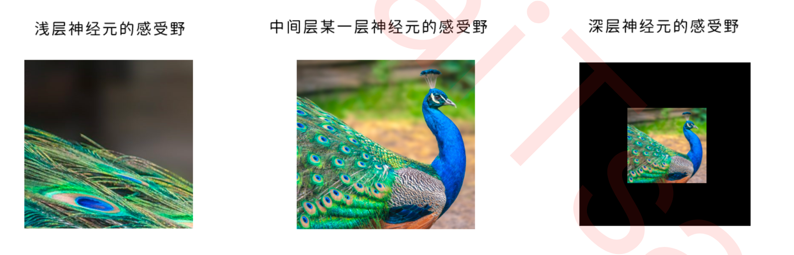
4.   **关注中心, 周围模糊**
     *   对于特征图来说, 每个神经元所捕捉到的感受野区域不同, 但这些区域是会有重叠的. 越是位于中间的像素, 被扫描的次数越多, 感受野重叠也就会越多
     *   因此位于图像中间的像素对最终特征图的影响更大, 对卷积神经网络的分类造成的影响也更大
     *   所以, 使用远远超出图像尺寸的感受野, 而将图像信息“锁”在感受野中心, 让本来应该“模糊”的部分全都被黑边所替代, 就是最有效的做法. **这就是为什么我们需要越大越好、甚至远超图片尺寸的的感受野**(也就是“带黑边”的感受野)
5.   **感受野的大小只与卷积核大小、各层步长有关, 与padding无关**
     *   感受野尺寸 = 上一层的感受野尺寸+(这一层的核尺寸-1)*(从第一层到上一层的步长的累乘之积) 


**扩大感受野的方法**:
1.   增加深度
2.   使用池化层
3.   膨胀卷积、残差连接等


### 膨胀卷积
**膨胀操作**: 以计算点为中心
*   膨胀率 = 1, 计算点就是全部的面积 
*   膨胀率 = 2, 在计算点周边扩充一圈像素 
*   膨胀率 = 3, 在像素周围填充2圈像素

**膨胀卷积**: 在每个参与卷积计算的计算点上做膨胀操作, 让计算点与计算点之间出现空洞, 并跳过空洞进行计算. 这样可以在不增加卷积核尺寸的情况下放大感受野

**膨胀率 = 1:**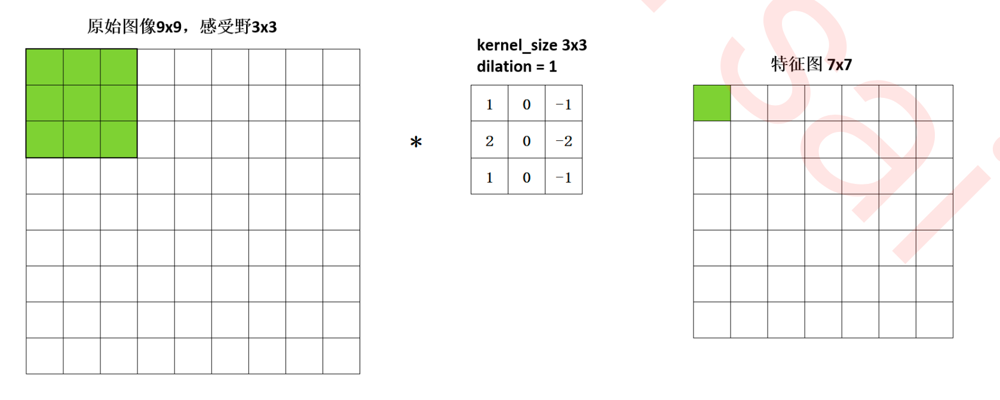

**膨胀率 = 2:**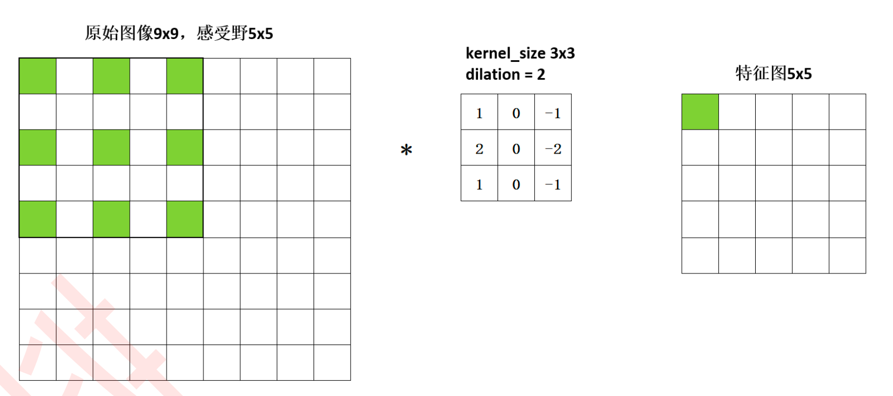

**膨胀率 = 3:**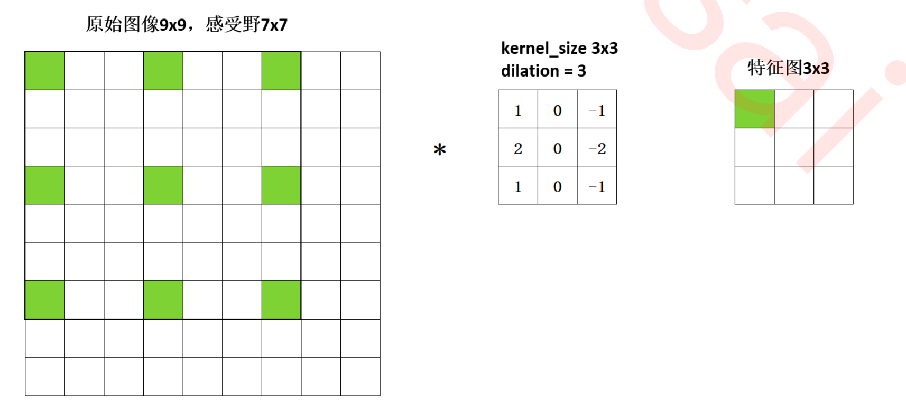

**膨胀卷积会改变输出的特征图的尺寸**, 膨胀率越大, 生成的特征图尺寸越小

**在经过多层卷积层后, 使用膨胀卷积并不会导致信息损失**:

膨胀前: 有较多重复信息(橙色格子为重复扫描)
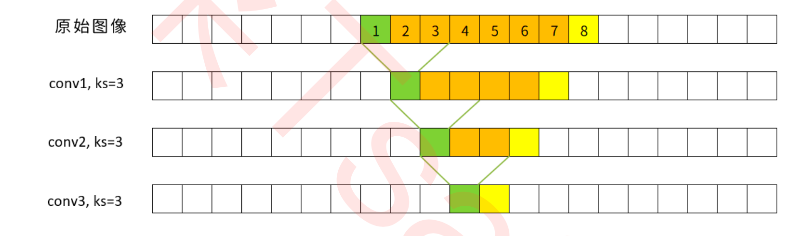

膨胀后: 像素之间相互补充
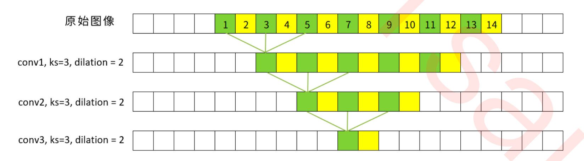

*但并不是在所有的架构里, 我们都能将膨胀卷积的洞完美补上*

## 平移不变性

**不变性**: 在训练集上被成功识别的对象, 即使以不同的姿态出现在测试集中, 也应该能被成功识别

**平移不变性**: 对图像上任意一个对象, 无论它出现在图像上的什么位置, 我们都能够识别这是同一个对象

**鲁棒性**: 一个模型或算法在不同数据、不同环境下的表现是否稳定. 一个过拟合的模型的鲁棒性一定是比较低的, 因为过拟合就意味着不能适用数据的变化

卷积神经网络的架构自带一定的平移不变性: 
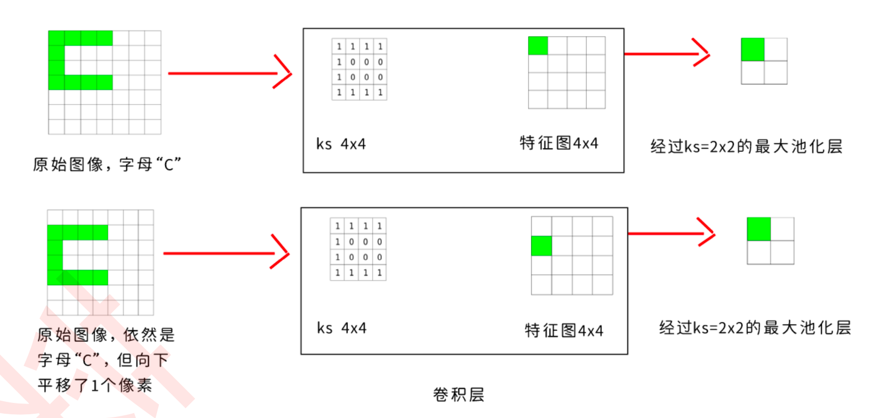

**越深的网络的平移不变性越强**, 但CNN的深度不可能无限增加, 而且除了平移不变性之外, 还有其他的不变性. 因此我们需要采取更强力的手段: **数据增强**

**数据增强**: 过添加略微修改的现有数据、或从现有数据中重新合成新数据来增加数据量
*   AlexNet和VGG都采用了数据增强来降低模型的过拟合程度


## 参数量计算
### 卷积层
一个卷积层包含的参数量由可尺寸、输入通道数、输出通道数共同决定: 
$$
N_{parameters} = (K_H \cdot K_W \cdot C_{in}) \cdot C_{out} + C_{out} \quad (11)
$$
*   在一次扫描中, 不同的通道使用不同的卷积核, 因此一个扫描的参数量 = (一个卷积核上的参数量*输入通道数)
*   若存在偏置项, 每次扫描完后, 搜需要在新生成的特征图上+一个偏置项, 因此总偏置项参数量 = 扫描次数 = 输出通道数
*   `padding`, `stride`不影响卷积层所需要的参数量


**大尺寸卷积核 vs 小尺寸卷积核:**
1.   2层3x3的卷积层 = 1层5x5的卷积层
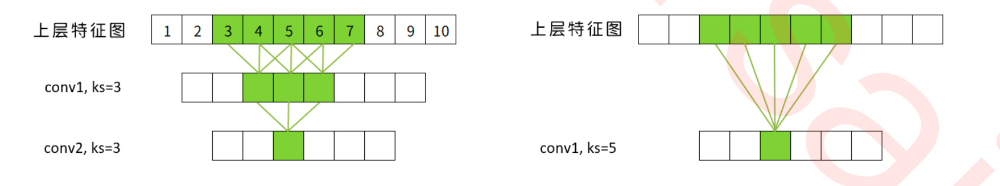
2.   1个5x5的卷积核在一次扫描中需要的参数量是25个, 2个3x3的卷积层只需要18个参数量. **在效果相同的情况下, 小卷积核的参数量更少**

**1x1卷积核(MLP layer)**
1.   无法识别高 和宽维度上相邻元素之间构成的模式
2.   可以在不损失信息的前提下加深CNN的深度
3.   一般用在两个卷积层之间, 用于调整输出的通道数(**先减少通道数, 然后进行计算, 然后再还原通道数**), 协助大幅度降低计算量和参数量(虽然可能有信息损失). **在核尺寸为1x1的2个卷积层之间包装其他卷积层的架构被称为瓶颈设计**
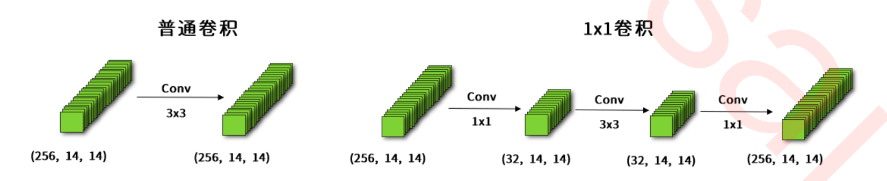
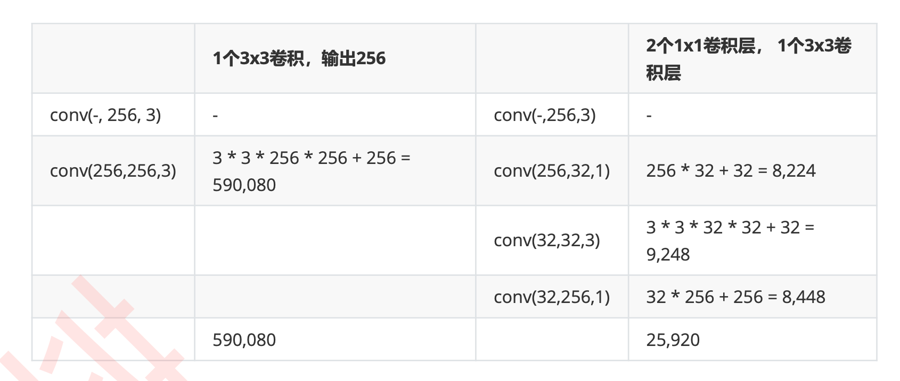

**分组卷积**
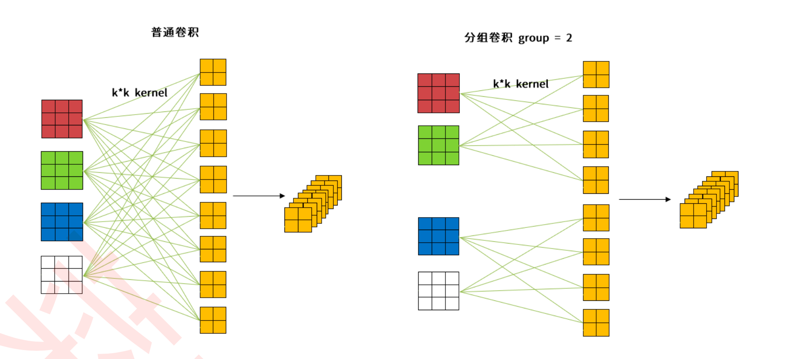
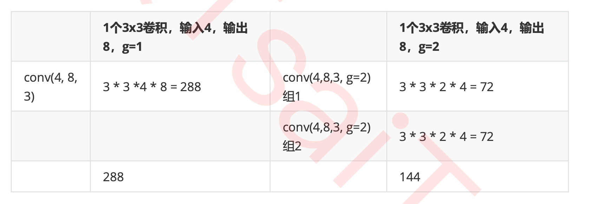
$$
total = group1 + group2
= \frac{1}{g} \left( K_H \cdot K_W \cdot C_{in} \cdot C_{out} \right) + C_{out}
$$
1.   分组的存在不影响偏置, 只与输出的特征图数量有关
2.   分组数必须能被通道数整除. 理论上来说, groups最大能去到min(输入通道数, 输出通道数)
3.   分组数 = 输入通道数的分组卷积称为**深度卷积**, 深度卷积+1x1卷积核 = 深度可分离卷积

### 全连接层

**全连接层在CNN中的作用**:
1.   作为分类器, 实现对数据的分类
     *   本质上来说, 卷积层提供了一系列有意义且稳定的特征值; 构成了一个与输入图像相比唯独更少的特征空间
     *   全连接层负责学习这个空间上的函数关系, 并输出预测结果
2.    作为**整合信息**的工具, 将特征图中的信息进行整合


**全卷积网络(FCN)**: 使用1x1卷积层代替全连接层
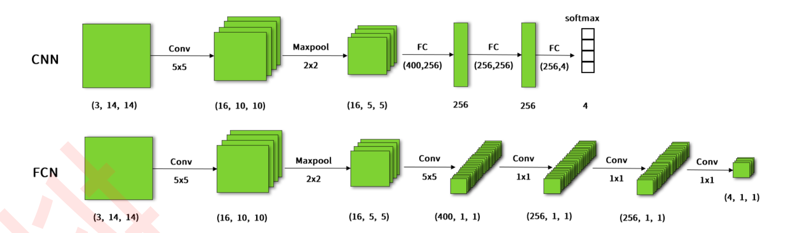
*   **使用1x1卷积层代替全连接层不能减少参数量**, 也没有明显提升模型效果
*   使用1x1卷积层最大的优点是解放了输入层对图像尺寸的限制, 也就是避免了输入图像尺寸改变时在全连接层拉平那一步的报错


**全局平均池化层(GAP)**: 池化核尺寸 = 特征图尺寸, 也就是**不论输入特征图尺寸是多少, 都输出1x1的特征图**