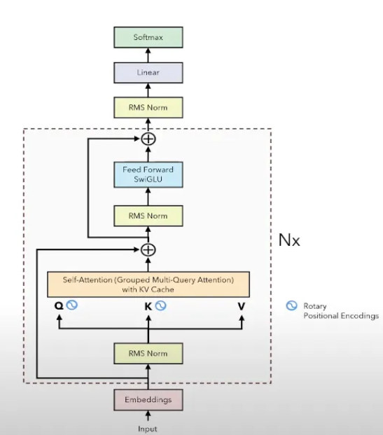
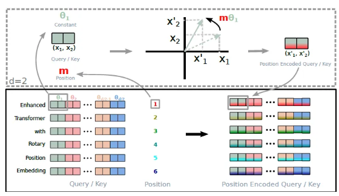

LLaMA是Decoder Only架构, 架构图如下:



最小的LLaMA也有七八十个Decoder串联

多头注意力机制计算并不会比单头注意力机制快

# Embedding层
输入的数据格式为(`batch_size`, `seq_len`), 经过embedding层输出的数据格式为(`batch_size`, `seq_len`, `d_model`)

最小的LLaMA的d_model = 4096

embedding层的参数量 = 不重复的词语的数量 x d_model (对大模型来说一般至少为10w*4096)

LLaMA独特的设计: **embedding层 - 输出层权重共享**:
*   embedding层的参数量为covab_size * d_model
*   output = Linear(d_model, vocab_size)
*   二者参数量相等, 且都代表语义解读, 因此embedding层的参数矩阵转置一下就能给output层用了


# RMSNorm均方根层归一化

  $$
  \text{RMS} = \sqrt{\frac{1}{n} \sum_{i=1}^{n} x_i^2}
  $$
 **归一化公式**：  
   - **LayerNorm** 会对输入特征的均值和方差进行计算，然后用这些统计量对每个特征进行归一化。
   - **RMSNorm** 只计算输入特征的均方根，而不考虑均值。因此, RMSNorm去掉了均值的计算，直接利用每个特征的均方根进行归一化。

```python
class RMSNorm(torch.nn.Module):
    # 初始化函数，接受参数：
    # dim: 归一化的维度大小
    # eps: 防止除零的非常小的数值
    def __init__(self, dim: int, eps: float):
        super().__init__()  # 调用父类的初始化方法
        self.eps = eps  # 将 eps 存储为类的属性
        # 初始化可学习的参数 weight，初始值为全1，形状为(dim,)
        # 这是每个维度的缩放系数
        self.weight = nn.Parameter(torch.ones(dim))  

    # 定义一个内部方法 _norm，用于对输入 x 进行归一化操作
    def _norm(self, x):
        # 使用平方的均值作为输入的标准差，并加上 eps 以防止除零
        # torch.rsqrt 是计算平方根的倒数，即 1 / sqrt(x)
        return x * torch.rsqrt(x.pow(2).mean(-1, keepdim=True) + self.eps)

    # 定义前向传播的操作
    def forward(self, x):
        # 首先调用 _norm 方法对输入 x 进行归一化，并确保类型一致性
        # x.float() 将输入转换为浮点数进行精度较高的计算
        output = self._norm(x.float()).type_as(x)  
        # 将归一化后的输出乘以可学习的参数 weight，调整每个维度的缩放
        return output * self.weight

```


# RoPE旋转位置编码

**Rotary Positional Embedding**（旋转位置编码）的流程可: 
1. **x1 和 x2 是 token 的原始编码值**。
2. **θ1（theta1）** 是一个常数，为每两维度的编码设置。我们将[$\theta_1, \theta_2...\theta_{d/2}$]这个序列总称为“频率”。
3. **m 是 position（位置）**，表示当前 token 在序列中的位置。
4. 通过**m * θ** 计算角度，并将 **x1 和 x2** 按照这个角度进行旋转，得到新的编码 **x'1 和 x'2**。



*   当两个token距离很近时, 他们旋转后的向量之间的夹角也会是很小的锐角, 点积（相似度）也会较大
*   当两个token距离很远时, 他们旋转后的向量的夹角角度就会更大, 点积会受到旋转的影响，导致权重下降


旋转位置编码只在QK矩阵上应用, 不需要对V矩阵应用

正余弦编码表达的是绝对的位置信息, 而旋转位置编码是相对的位置信息