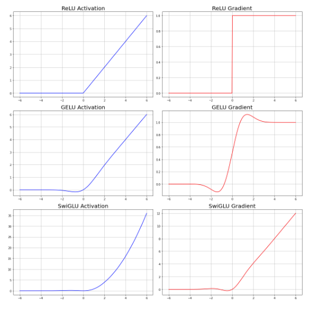
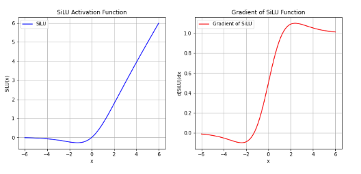
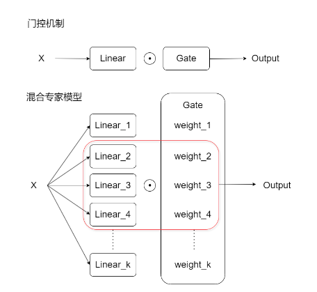

LLaMA是Decoder Only架构, 架构图如下:


最小的LLaMA也有七八十个Decoder串联

多头注意力机制计算并不会比单头注意力机制快

# Embedding层
输入的数据格式为(`batch_size`, `seq_len`), 经过embedding层输出的数据格式为(`batch_size`, `seq_len`, `d_model`)

最小的LLaMA的d_model = 4096

embedding层的参数量 = 不重复的词语的数量 x d_model (对大模型来说一般至少为10w*4096)

LLaMA独特的设计: **embedding层 - 输出层权重共享**:
*   embedding层的参数量为covab_size * d_model
*   output = Linear(d_model, vocab_size)
*   二者参数量相等, 且都代表语义解读, 因此embedding层的参数矩阵转置一下就能给output层用了


# RMSNorm均方根层归一化

  $$
  \text{RMS} = \sqrt{\frac{1}{n} \sum_{i=1}^{n} x_i^2}
  $$
 **归一化公式**：  
   - **LayerNorm** 会对输入特征的均值和方差进行计算，然后用这些统计量对每个特征进行归一化。
   - **RMSNorm** 只计算输入特征的均方根，而不考虑均值。因此, RMSNorm去掉了均值的计算，直接利用每个特征的均方根进行归一化。

```python
class RMSNorm(torch.nn.Module):
    # 初始化函数，接受参数：
    # dim: 归一化的维度大小
    # eps: 防止除零的非常小的数值
    def __init__(self, dim: int, eps: float):
        super().__init__()  # 调用父类的初始化方法
        self.eps = eps  # 将 eps 存储为类的属性
        # 初始化可学习的参数 weight，初始值为全1，形状为(dim,)
        # 这是每个维度的缩放系数
        self.weight = nn.Parameter(torch.ones(dim))  

    # 定义一个内部方法 _norm，用于对输入 x 进行归一化操作
    def _norm(self, x):
        # 使用平方的均值作为输入的标准差，并加上 eps 以防止除零
        # torch.rsqrt 是计算平方根的倒数，即 1 / sqrt(x)
        return x * torch.rsqrt(x.pow(2).mean(-1, keepdim=True) + self.eps)

    # 定义前向传播的操作
    def forward(self, x):
        # 首先调用 _norm 方法对输入 x 进行归一化，并确保类型一致性
        # x.float() 将输入转换为浮点数进行精度较高的计算
        output = self._norm(x.float()).type_as(x)  
        # 将归一化后的输出乘以可学习的参数 weight，调整每个维度的缩放
        return output * self.weight

```


# RoPE旋转位置编码

**Rotary Positional Embedding**（旋转位置编码）的流程可: 
1. **x1 和 x2 是 token 的原始编码值**。
2. **θ1（theta1）** 是一个常数，为每两维度的编码设置。我们将[$\theta_1, \theta_2...\theta_{d/2}$]这个序列总称为“频率”。
3. **m 是 position（位置）**，表示当前 token 在序列中的位置。
4. 通过**m * θ** 计算角度，并将 **x1 和 x2** 按照这个角度进行旋转，得到新的编码 **x'1 和 x'2**。


*   当两个token距离很近时, 他们旋转后的向量之间的夹角也会是很小的锐角, 点积（相似度）也会较大
*   当两个token距离很远时, 他们旋转后的向量的夹角角度就会更大, 点积会受到旋转的影响，导致权重下降


旋转位置编码只在QK矩阵上应用, 不需要对V矩阵应用. 因为只有QK矩阵和相对的权重有关, 而V表达的是语义信息

正余弦编码表达的是绝对的位置信息, 而旋转位置编码是相对的位置信息

# KV缓存

**KV缓存大部分时候适用于推理，因此这个流程大部分时候是自回归的**

1. **初始化**：
   - 当生成开始时，模型计算输入序列的Key和Value，并将这些计算结果缓存起来，保存在内存中。
     
   - **大部分时候，每个注意力层都会有一对Key-Value缓存，这个缓存是在自回归的每次循环中共用。然而，有时我们也可以在多头注意力机制中、只保留一个头或两个头上的KV值，并共享给所有的头使用**。其中，每次循环中的kv缓存，是推理中常见的用法。多头共享kv的缓存，可以被用于训练和推理两个流程，但可能伤害训练的结果。
     
   - 这些缓存的Key和Value会存储到KV缓存中，并作为后续生成步骤中的参考。

2. **生成过程中**：
   - 当生成下一个token时，模型不需要重新计算前面已经生成的token的Key和Value。它会直接使用之前缓存的Key和Value。
   - 只需要计算当前token的Query，并将它与已经缓存的Key进行点积计算，得出注意力分数。
   - 这些注意力分数会结合缓存的Value来计算当前token的输出。

3. **更新缓存**：
   - 对于每一个生成步骤，模型还会将当前生成的token的Key和Value加入缓存，确保缓存中的Key和Value始终保持更新，包含所有已经生成的tokens。
   - 缓存的大小会逐渐增加，最终会包含所有生成序列的Key和Value。


多头注意力机制共享KV的情形: 

比如对于8头注意力机制来说, 缓存前两个kv(也就是重复次数 n_rep = 4), 那么实际上的注意力操作为: 

Q1 -> K1 V1 <br>
Q2 -> K2 V2 <br>
Q3 -> K1 V1 <br>
Q4 -> K2 V2 <br>
Q5 -> K1 V1 <br>
Q6 -> K2 V2 <br>
Q7 -> K1 V1 <br>
Q8 -> K2 V2 <br>

下面一段代码是允许多头注意力机制的多个头共享kv缓存的代码。如果要让每个头都拥有自己独特的k和v，只在推理过程中每个循环中进行缓存，那只要让n_rep=1即可

```python
def repeat_kv(x: torch.Tensor, n_rep: int) -> torch.Tensor:
    """torch.repeat_interleave(x, dim=2, repeats=n_rep)"""
    # 定义函数 repeat_kv，接受两个参数：张量 x 和重复次数 n_rep
    # x 是一个形状为 (bs, slen, n_kv_heads, head_dim) 的张量，分别代表：
    # bs: 批次大小 (batch size)
    # slen: 序列长度 (sequence length)
    # n_kv_heads: KV 头的数量 (number of key-value heads)
    # head_dim: 每个头的维度大小 (dimension size of each head)
    # n_rep: 重复次数

    # 获取张量的形状 (bs: 批次大小, slen: 序列长度, n_kv_heads: KV 头的数量, head_dim: 每个头的维度)
    bs, slen, n_kv_heads, head_dim = x.shape

    # 如果 n_rep 为 1，表示不需要重复，直接返回原始张量
    if n_rep == 1:
        return x

    # 执行以下操作以重复 KV 头：
    # 1. 在第 4 维度 (即 None) 上扩展 x，使其形状为 (bs, slen, n_kv_heads, 1, head_dim)
    # 2. 使用 expand 函数将第 4 维度扩展为 n_rep，得到形状 (bs, slen, n_kv_heads, n_rep, head_dim)
    # 3. 最后通过 reshape 将形状重新调整为 (bs, slen, n_kv_heads * n_rep, head_dim)
    # 这会将每个 KV 头重复 n_rep 次
    return (
        x[:, :, :, None, :]                       # 扩展张量，在 n_kv_heads 后增加一个维度
        .expand(bs, slen, n_kv_heads, n_rep, head_dim)  # 扩展 n_rep 次
        .reshape(bs, slen, n_kv_heads * n_rep, head_dim)  # 调整形状为新的维度
    )
```

# 门控前馈神经网络FFN

**典型前馈网络**：
$$
  \text{Output} = \text{Linear2}(\text{Activation}(\text{Linear1}(x)))
$$
  它通过一个线性层（`Linear1`），一个非线性激活函数（如ReLU或GELU），然后通过另一个线性层（`Linear2`）。

**llama中的前馈神经网络**
$$
\text{Output} = \text{Linear2}
\left( \textcolor{red}{\text{Activation}}\left( \textcolor{green}{\text{Linear1}}(x) \right) 
\odot \textcolor{gold}{\text{Linear3}}(x) \right)
$$
  它通过两个线性层（`Linear1`和`Linear3`），从`Linear1`输出的结果经过silu激活函数后，与`Linear3`输出的结果进行逐元素乘法，然后通过另一个线性层（`Linear2`）。

$$
\text{Output} = \text{Linear2}
\left( \textcolor{red}{\text{Silu}}\left( \textcolor{green}{\text{Linear1}}(x) \right) 
\odot \textcolor{gold}{\text{Linear3}}(x) \right)
$$

## SwiGLU激活函数

$$
\text{SwiGLU}(x) = \textcolor{red}{\text{GELU}}\left( \textcolor{green}{W_1^a} \cdot x \right) 
\odot \textcolor{gold}{W_1^b} \cdot x
$$

其中：
- $W_1^a$ 和 $W_1^b$ 是线性变换（全连接层）
- $\odot$ 表示 **逐元素乘法**（element-wise multiplication）


门控机制由信息和门两部分组成, 其中门来控制信息通过的多少. 通过挤压信息的通道, 迫使信息表达更高效

$\textcolor{red}{\text{GELU}}\left( \textcolor{green}{W_1^a} \cdot x \right)$ -> 信息

$\textcolor{gold}{W_1^b} \cdot x$ -> 门


| **特性**           | **ReLU**                        | **GELU**                      | **SwiGLU with GELU**                    |
|--------------------|---------------------------------|--------------------------------|--------------------------------|
| **表达能力**       | 线性激活，易丢失负值信息         | 平滑激活，但无门控机制         | 动态门控，表达能力最强         |
| **梯度流动**       | 负值梯度为 0，可能导致死神经元   | 平滑梯度流动                   | 更平滑的梯度流动，训练更稳定   |
| **训练效率**       | 计算简单，但可能不稳定, 大模型中基本不用           | 计算稍复杂，但效果更好         | 高效计算，适合大规模模型       |



llama架构中没有使用GELU, 因为GELU加上门控机制后, 梯度变成逐渐上升的趋势; 而是使用SiLU激活函数, 这样可以保证梯度仍然在1附近 

$$
\text{SiLU}(x) = x \cdot \sigma(x)
$$

其中：
- $x$ 是输入值。
- $\sigma(x)$ 是 **Sigmoid** 函数：
  $$
  \sigma(x) = \frac{1}{1 + e^{-x}}
  $$




# 混合专家网络MoE


混合专家模型是很多扇门


多个门组成的结构叫**路由器**, 混合专家模型是一种动态路由策略, MoE每次向前传播时只激活部分专家模型

MoE可以替代FFN层

MoE适合巨量模型, 10b以下模型较少使用

## MoE的训练

1. **输入数据准备**：输入数据通过模型的编码层或其他层，产生**隐状态 (hidden states)**，作为路由器和专家模型的输入

2. **路由器（Gate）计算权重**：路由器根据输入数据，计算每个专家的**激活权重**。使用 **softmax** 或其他激活函数计算每个专家的得分（`G_i(x)`），然后通过 **top-k** 筛选出权重最大的专家

3. **选择 Top-k 专家**：使用 `torch.topk()` 函数，选择 **top-k** 个得分最高的专家。只有这 **k** 个专家参与向前传播的计算，其他专家的输出会被忽略（权重为 0）

4. **专家计算输出**：被选中的 **Top-k** 专家根据输入数据计算它们的输出。路由器的权重用于对这些输出进行**加权求和**

5. **损失计算与辅助损失（Auxiliary Loss）**：除了常规损失（如交叉熵），还引入**辅助损失**，确保所有专家都能被均衡使用，避免某些专家“过度使用”或“闲置”
6. **反向传播与参数更新**：使用反向传播更新所有专家的参数，以及路由器的参数。即使某些专家在当前 batch 中未被激活，它们的参数也可能因为**累积梯度**而被更新

注意，在一次前向传播中，未被激活的专家不会参与计算，因此它们的梯度也不会直接更新。但是，模型通常会在多个 batch 或不同输入中均衡地激活不同的专家，因此所有专家的参数会在整个训练过程中得到更新

专家的选择并非针对于整个批次的整体输出，而是**针对每个 token（或时间步）进行选择和计算**的 

- **路由器**会根据每个 token 的输入特征计算 softmax 得分，并为每个 token 选择 Top-k 个专家。
- 这样可以确保模型的不同部分专注于处理特定类型的特征，例如：
  - 某个专家可能擅长处理动词结构
  - 另一个专家可能擅长处理名词短语


## 瓶颈问题

专家瓶颈: 在少数专家上过拟合, 而其他专家被闲置

为了解决专家瓶颈问题, 需要引入辅助损失, 来惩罚专家分布不均衡的情况

$$\text{Total Loss} = \text{Main Loss} + \alpha \cdot \text{Auxiliary Loss}$$

辅助函数的设计思路主要是比较每个权重与平均权重的差异, 若差异之和较大, 说明比较不均衡. 是一个类似于方差的思路. 以下有几种辅助函数的设计

/
1. **负载平衡损失 (Load Balancing Loss)**：促进不同专家的负载更加平衡，避免过度依赖某个专家。一种常见的形式是使用专家的选择频率与分配的均衡性来构造。通常，目标是让每个专家的选择概率与理想的均匀分布更接近。
     $$
     \text{aux\_loss} = \sum_{i=1}^{N} f_i \log(f_i)
     $$
     其中 $ f_i $ 是第 $ i $ 个专家被选择的频率。

2. **基于熵的损失 (Entropy-based Loss)**：通过增加专家选择的熵，鼓励模型选择更多的专家来参与计算，从而减少某些专家的过载。
     $$
     \text{aux\_loss} = - \sum_{i=1}^{N} P_i \log(P_i)
     $$
     其中 $P_i$ 是分配给第 $i$ 个专家的概率。熵越高，说明分配越均匀。

3. **KL 散度损失 (KL Divergence Loss)**：将实际的专家选择分布与理想的均匀分布进行比较。
     $$
     \text{aux\_loss} = \text{KL}(P || U)
     $$
     其中 $P$ 是模型计算出的专家分配概率分布，$U$ 是理想的均匀分布。通过最小化 KL 散度，确保专家选择接近均匀分布，避免某些专家被过度使用。

4. **专家负载正则化 (Expert Load Regularization)**：控制每个专家的负载，使得负载接近于模型的理想目标负载，比如让每个专家处理相同数量的样本。
     $$
     \text{aux\_loss} = \sum_{i=1}^{N} (\text{load}_i - \text{target\_load})^2
     $$
     其中 $\text{load}_i$ 是第 $i$ 个专家的实际负载，$\text{target\_load}$ 是理想的负载。

实际使用的损失函数是负载平衡损失的粗糙版本, 因为log计算太慢了, 因此用使用率这个指标来代替log的计算:

$$
\text{aux\_loss} = \alpha \times \sum_{i=1}^{N_{\text{routed\_experts}}} (P_i \cdot f_i)
$$

- $N_{\text{routed\_experts}}$ 是专家的数量。
- $P_i$ 是所有专家的平均权重(基于token的平均)
- $f_i$ 是专家的平均使用率(基于token的平均)


## MoE的推理

由于推理时只有一次向前传播, 因此推理过程并不是所有专家都会参与计算

1. **输入数据通过路由器**：输入数据经过路由器，路由器根据当前输入，计算每个专家的得分（`G_i(x)`）
2. **激活 Top-k 专家**：路由器选择 **Top-k** 个得分最高的专家，并忽略其他专家
3. **Top-k 专家输出计算**：只有这 **Top-k** 个专家参与计算，其他专家的输出为 0，减少了计算开销
4. **加权求和得到最终输出**：路由器对这 **Top-k** 个专家的输出进行**加权求和**，得到模型的最终输出


| **阶段**        | **训练**                                  | **推理**                                  |
|----------------|-------------------------------------------|------------------------------------------|
| **激活专家数**  | Top-k 专家参与计算，但所有专家更新参数      | 只激活 Top-k 专家，其他专家不计算         |
| **反向传播**    | 需要反向传播和梯度计算                     | 不需要梯度计算                            |
| **内存占用**    | 高（需要存储所有专家的参数和梯度）           | 低（只需要存储部分专家的输出）             |
| **计算量**      | 高（所有专家的梯度都可能被更新）             | 低（只计算部分专家的输出）(这个计算量不是和FFN比, 而是和同样学习能力的n个线性层相比)                 |
| **负载均衡**    | 需要负载均衡，避免专家使用不均              | 不需要，因为只需一次前向传播               |
| **跨设备通信**  | 需要频繁的跨设备通信                       | 通信需求较低                              |


