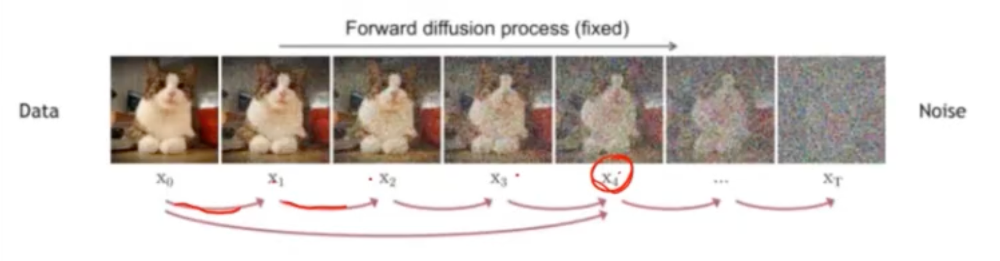
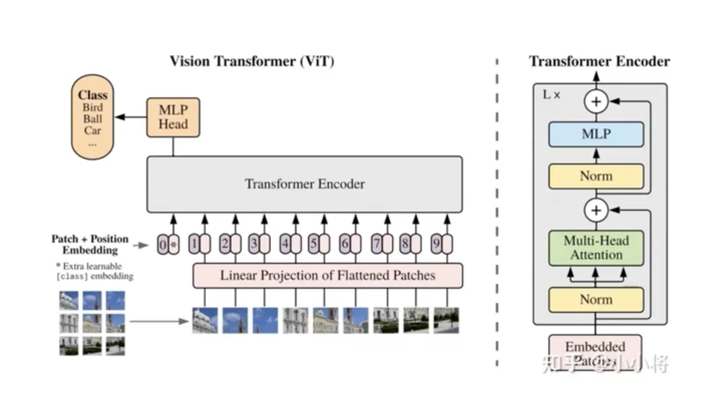
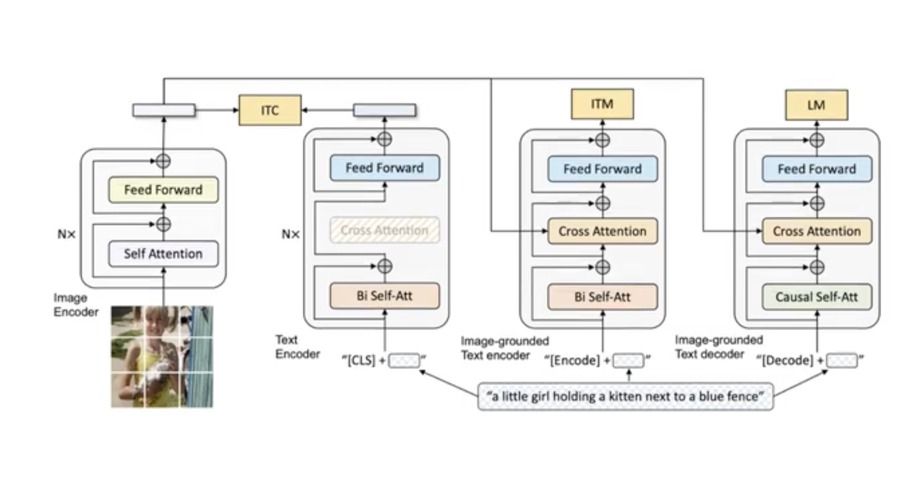
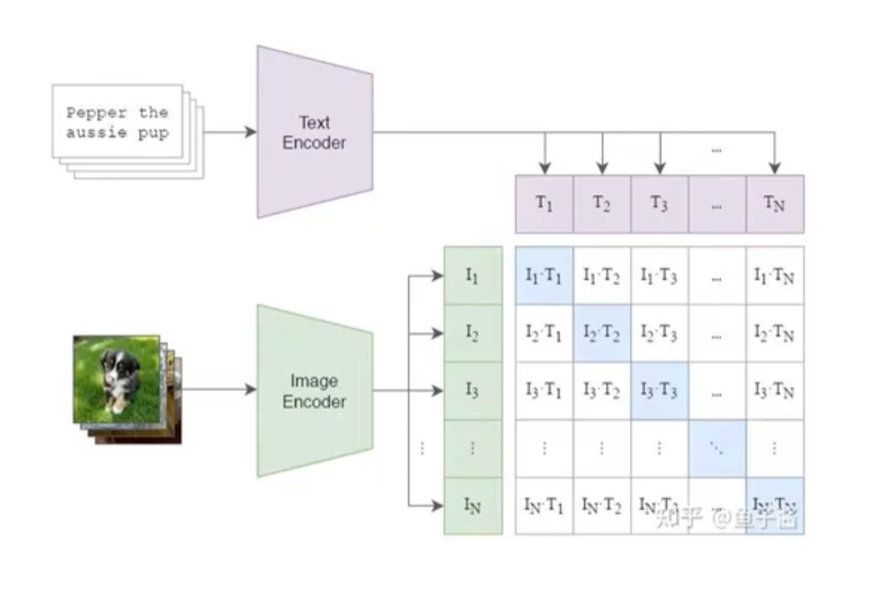
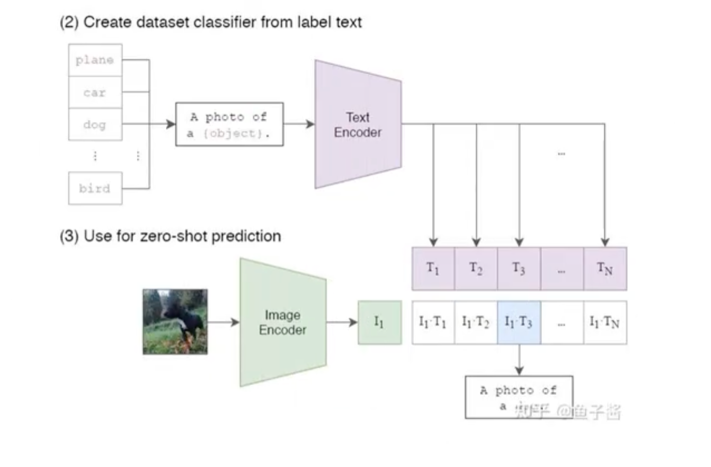
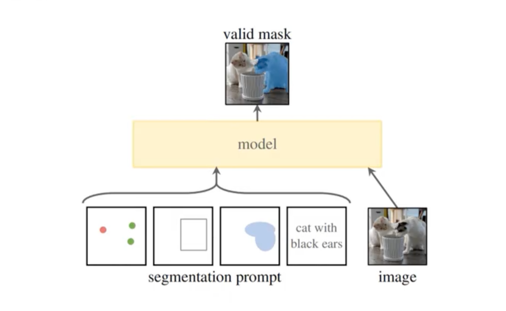
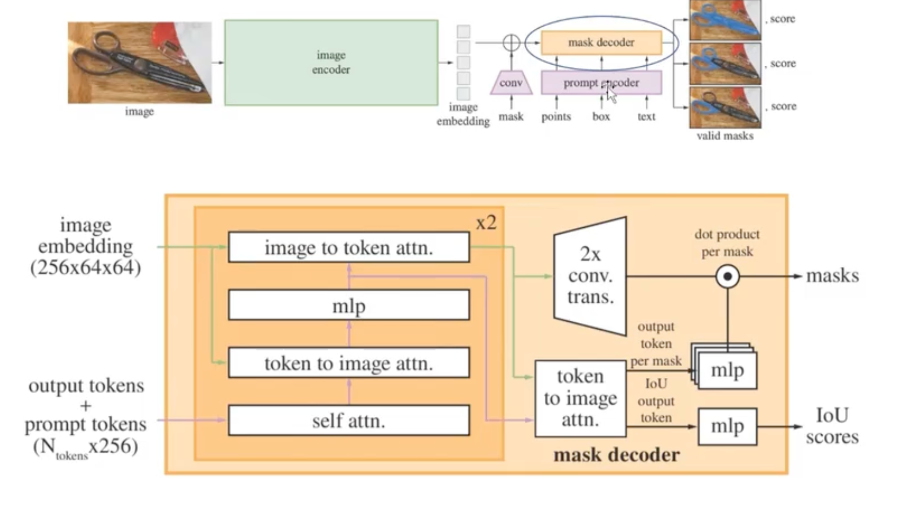
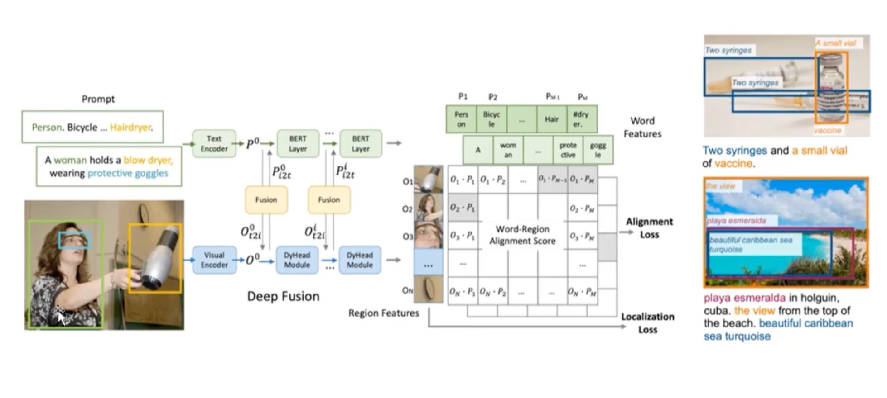

# AIGC扩散学习


**正向扩散过程（Forward Diffusion Process）**

- 目标：将真实数据逐步转变为接近纯噪声的形式。
- 过程描述：
    - 对于一个真实数据样本 $x_0$（例如，一张图像），通过一系列预定的时间步 $t = 1, 2, \ldots, T$ 逐步加入噪声。
    - 每一步可以看作是一个马尔可夫过程(一类随机过程，其特点是满足“无记忆性”（马尔可夫性），即未来状态只依赖于当前状态，而与过去的状态无关)：
     $$q(x_t \mid x_{t-1}) = \mathcal{N}(x_t; \sqrt{1-\beta_t}\,x_{t-1}, \beta_t \mathbf{I})$$
    - 随着 $t$ 的增加，数据 $x_t$ 变得越来越随机，到了 $t = T$ 时，$x_T$ 通常接近于标准正态分布 $\mathcal{N}(0, \mathbf{I})$。

  
**反向生成过程（Reverse Denoising Process）**

  - 目标：训练一个神经网络（去噪网络或生成网络），通过逐步“去噪”，从纯噪声中恢复出原始数据分布。
  - 过程描述：
    - 反向过程试图近似正向过程的逆转，即从 $x_T$ 开始，通过一系列反向步骤恢复出 $x_0$：
       $$p_\theta(x_{t-1} \mid x_t) = \mathcal{N}(x_{t-1}; \mu_\theta(x_t, t), \Sigma_\theta(x_t, t))$$
    - 其中，$\mu_\theta(x_t, t)$ 和 $\Sigma_\theta(x_t, t)$ 是由神经网络参数 $\theta$ 预测的均值和协方差。
  - 训练目标：
    - 常用的损失函数是最小化每一步反向过程中预测误差，即预测正向过程中加入的噪声：
       $$\mathcal{L} = \mathbb{E}_{x_0, \epsilon, t} \left[ \left\| \epsilon - \epsilon_\theta(x_t, t) \right\|^2 \right]$$
    - 其中，$\epsilon$ 是正向过程中加入的真实噪声，而 $\epsilon_\theta(x_t, t)$ 是网络对噪声的预测。
    - 通过这种方式，模型学会如何从当前的噪声 $x_t$ 中预测并去除噪声，从而逐步还原出原始数据。

**生成新样本的步骤：**

  - 初始化：
    - 从标准正态分布中采样一个初始噪声 $x_T \sim \mathcal{N}(0, \mathbf{I})$。
  - 迭代去噪：
    - 利用训练好的模型，从 $t = T$ 开始逐步进行反向采样，直到 $t = 0$：
   $$x_{t-1} \sim p_\theta(x_{t-1} \mid x_t)$$
  - 生成结果：
    - 最终得到的 $x_0$ 就是模型生成的新样本，它应当符合原始数据分布。


 ```python
# 定义一个简单的去噪网络，这里用 MLP 举例
class SimpleDenoiseNet(nn.Module):
    def __init__(self, in_features=1, hidden_dim=128, out_features=1):
        super(SimpleDenoiseNet, self).__init__()
        # 注意：输入除了原始数据外，还要拼接时间步 t
        self.model = nn.Sequential(
            nn.Linear(in_features + 1, hidden_dim),  # 输入特征数+1
            nn.ReLU(),
            nn.Linear(hidden_dim, hidden_dim),
            nn.ReLU(),
            nn.Linear(hidden_dim, out_features)
        )
        
    def forward(self, x, t):
        # x: shape (batch_size, in_features)
        # t: shape (batch_size, 1)，表示当前时间步（可以归一化）
        x_input = torch.cat([x, t], dim=1)
        return self.model(x_input)

# 定义一个线性 beta 调度函数，决定每个时间步添加噪声的方差
def linear_beta_schedule(timesteps, beta_start=0.0001, beta_end=0.02):
    return torch.linspace(beta_start, beta_end, timesteps)

# 训练扩散模型的过程
def train_diffusion_model(model, dataloader, timesteps, device, epochs=10):
    optimizer = optim.Adam(model.parameters(), lr=1e-3)
    beta = linear_beta_schedule(timesteps).to(device)  # shape: (timesteps,)
    
    # 计算 alpha 和累计乘积 alpha_bar
    alpha = 1 - beta  # 每个时间步的保留比例
    alpha_bar = torch.cumprod(alpha, dim=0)  # 累计乘积，用于前向过程
    
    for epoch in range(epochs):
        for batch in dataloader:
            # 假设 batch 为一个 tuple，第一个元素是数据，形状 (batch_size, features)
            real_data = batch[0].to(device)
            batch_size = real_data.size(0)
            
            # 随机为每个样本选择一个时间步 t（范围 0 ~ timesteps-1）
            t = torch.randint(0, timesteps, (batch_size,), device=device).unsqueeze(1).float()
            
            # 根据 t 取出对应的 alpha_bar 值（这里需要将 t 转为 long 型索引）
            alpha_bar_t = alpha_bar[t.long()].view(batch_size, 1)
            
            # 采样噪声，噪声与数据形状一致
            noise = torch.randn_like(real_data)
            
            # 根据正向扩散过程公式生成噪声数据：
            # x_t = sqrt(alpha_bar_t) * real_data + sqrt(1 - alpha_bar_t) * noise
            x_t = torch.sqrt(alpha_bar_t) * real_data + torch.sqrt(1 - alpha_bar_t) * noise
            
            # 使用模型预测噪声
            noise_pred = model(x_t, t)
            
            # 损失函数为真实噪声与预测噪声之间的均方误差
            loss = ((noise - noise_pred) ** 2).mean()
            
            optimizer.zero_grad()
            loss.backward()
            optimizer.step()
        
        print(f"Epoch {epoch+1}/{epochs}, Loss: {loss.item():.6f}")

# 示例：使用一个虚拟数据集进行训练
if __name__ == '__main__':
    from torch.utils.data import DataLoader, TensorDataset
    import numpy as np
    
    device = torch.device("cuda" if torch.cuda.is_available() else "cpu")
    
    # 构造一个简单的虚拟数据集，例如一维数据（可视为灰度图像的简化版）
    data = np.random.rand(1000, 1).astype(np.float32)
    dataset = TensorDataset(torch.tensor(data))
    dataloader = DataLoader(dataset, batch_size=32, shuffle=True)
    
    # 初始化去噪模型
    model = SimpleDenoiseNet(in_features=1, hidden_dim=128, out_features=1).to(device)
    
    # 设置扩散过程的时间步数
    num_timesteps = 100
    
    # 开始训练
    train_diffusion_model(model, dataloader, timesteps=num_timesteps, device=device, epochs=5)
```

# Vit: Vision Transformer
纯视觉模型

在大规模图像数据集（如 ImageNet）上进行监督学习，目标是直接预测图像的类别标签

训练过程专注于提取视觉特征并映射到具体的类别



# Blip


# Clip
多模态模型 双塔结构 泛化能力强

使用大量的图像-文本对进行训练，目标是最大化真实图像与对应文本之间的相似度，同时降低与不匹配文本之间的相似度



在 CLIP 的训练中，一个批次内通常包含多个图像与其对应的文本描述。对于每一个正确匹配的图像-文本对来说，批次中其他不匹配的图像或文本就作为负样本对出现。这种做法称为“in-batch negatives”，其核心思想可以这样理解：

- 正样本对(对角线上 = 1)：在同一批次中，每个图像与它对应的文本描述形成一个正样本对，因为它们本应语义上是一致的。

- 负样本对(除了对角线以外的其他)：对于任意一个图像来说，同一批次中其他所有非对应的文本都被视为负样本，反之亦然。也就是说，一个图像与其他不匹配的文本构成了负样本对，因为它们在语义上不应该匹配。

Batch size的选择:
- batch size太小, 负样本太少, 训练效果不佳
- 在类别数较小的时候, batch size不能太大, 负样本容易出现误差(负样本不是真正的负样本)

Clip能够zero shot识别的原因在于:
- 训练集够大, zero shot任务的图像和concept在训练集中都可以找到类似的
- 将分类任务转化为检索任务(把每个类别描述看作一个“查询”，把输入图像看作一个“待检索的项”, 相当于我们在这个嵌入空间中“检索”最匹配的文本描述，最后将图像归入相似度最高的类别)

# SAM(Segment Anything)

cv的技术路线是: **目标分割**->目标检测->目标识别->目标跟踪

SAM作为分割领域的基础模型, 采用了大规模数据进行预训练, 使其在**零样本**场景下就能对各种未见过的物体进行分割, 不需要针对具体任务进行微调





利用强大的**视觉编码器**提取丰富的图像特征，再通过**提示编码器**灵活捕捉用户意图，最后由**掩码解码器**高效生成分割结果

prompt可以是点、框、mask和文字->转化为向量序列
- point, bix可以使用position encoding
- text可以使用CLIP作为encoder
- mask是一种密集型prompt, 可以使用CNN作为encoder

# Glip
Glip是一个**目标检测**模型



将检测问题转化为检索问题, 尝试用短语匹配的方式进行检测