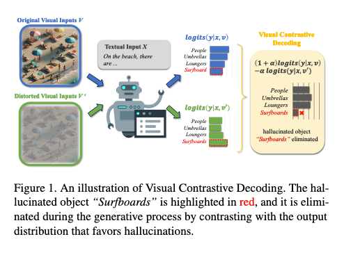
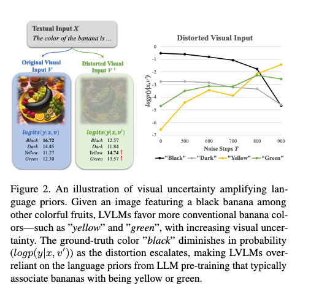
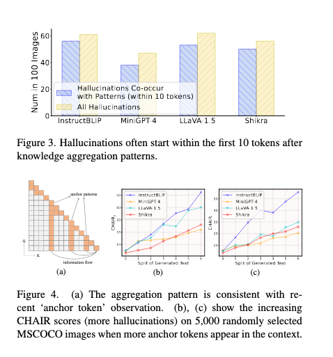
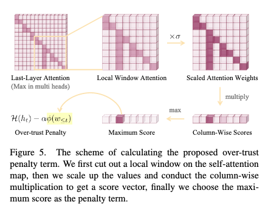
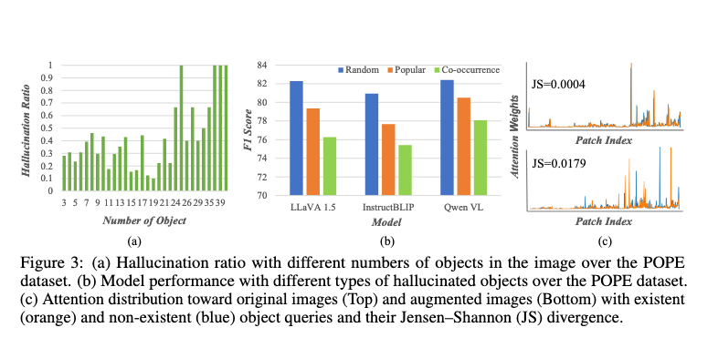

# Mitigating Object Hallucinations in Large Vision-Language Models through  Visual Contrastive Decoding

当视觉输入质量较低时，多模态大模型的幻觉主要来源于其预训练时学习到的语言先验知识，即模型更倾向于生成符合常识但未必真实存在的对象

为了抑制这种幻觉，VCD方法通过对比原始图像和人为添加噪音后的图像在模型中的 logits 变化，来检测和削弱幻觉对象. 在这个过程中，采用 APC(自适应合理性约束), 即在扭曲图像中仅考察原始图像下logits置信度较高的对象(置信度较低的token在添加噪音的图像中不被允许生成)。这样可以避免误惩罚合理的预测

如果某类信息的 logits 在扭曲图像下明显上升，则表明该信息更可能是由语言先验引发的幻觉，而非真实视觉输入的结果

因此，我们可以针对这些幻觉信息进行抑制，从而提高模型的生成质量和可靠性

VCD是一种用于**推理**阶段的方法
## VCD

VCD（Visual Contrastive Decoding，视觉对比解码）基于对比模型在原始视觉输入 $V$ 和扭曲视觉输入 $V'$ 下的 logits（未归一化分数），通过抑制那些更容易出现在 $V'$ 中但在 $V$ 中可能是错误的对象，提高生成内容的可靠性。

在 VCD 过程中，首先模型基于原始视觉输入 $V$ 计算 logits，即 $\text{logits}(y|x, V)$，表示模型在真实视觉信息下对不同类别的置信度估计。同时，模型还会基于扭曲视觉输入 $V'$ 计算 $\text{logits}(y|x, V')$，其中 $V'$ 经过扰动或模糊化，可能导致模型错误地预测某些对象，增加幻觉现象。

VCD 通过以下公式进行对比计算：
$$
(1 + \alpha) \cdot \text{logits}(y|x, V) - \alpha \cdot \text{logits}(y|x, V')
$$
其中，$\alpha$ 是一个权重参数。该公式的作用是：

1. **增强原始视觉输入 $V$ 的 logits**，使基于真实视觉信息的预测更可靠；
2. **抑制扭曲视觉输入 $V'$ 的 logits**，削弱那些受噪声影响较大的对象；
3. **通过对比策略识别幻觉对象**，如果一个对象在 $V'$ 中的 logits 较高但在 $V$ 中较低，说明它可能是错误预测的幻觉，从而被去除。

这种方法的核心思想是利用扭曲输入 $V'$ 来检测模型的幻觉模式。由于真实存在的对象通常在 $V$ 和 $V'$ 中的 logits 变化较小，而幻觉对象在 $V'$ 中的 logits 可能更高，因此通过这种对比操作，可以有效减少生成内容中的错误预测。例如，在海滩场景下，"Surfboards"（冲浪板）可能是因模型的先验偏见而产生的幻觉，但在 VCD 计算后，该对象被成功去除，使生成的内容更加真实可信。

VCD 的优势在于，它不依赖额外的人工标注或监督学习，而是利用输入数据自身的信息进行优化

**VCD是一种推理阶段的方法, 它不改变模型的训练参数, 而是直接在解码过程中调整logits. 扭曲输入 $V'$也是在推理过程中现场生成的**

## 幻觉的来源

原图是一张黑色香蕉, 但是当图片被模糊之后, 模型识别香蕉颜色为黄色或绿色的logits就上升了. 这是因为LLM预训练的语言知识更倾向于认为香蕉是绿色或者黄色的

当视觉信息变得模糊或扭曲时，多模态大模型（LVLMs, Large Vision-Language Models）更依赖语言知识，而非视觉输入

**预训练数据集中的高频对象更容易在扭曲视觉输入下被幻觉化**, 由于 LVLMs 在训练过程中学习到了某些对象的高频性，当视觉输入质量下降时，模型倾向于“猜测”常见对象的存在，而不是依赖实际视觉信息。

## APC

VCD 通过对比原始视觉输入 $V$ 和扭曲视觉输入 $V'$ 的 logits 来抑制幻觉对象。然而， **并非所有扭曲视觉输入下的预测都是错误的**，有些预测仍然符合**基本语言逻辑**和**常识推理** 避免对所有扭曲视觉输入下的输出进行无差别惩罚，以防误伤合理的预测

APC 的核心思想是**基于模型在原始视觉输入 $V$ 下的置信度，来决定哪些 token 是合理的，并对不合理的 token 进行抑制**。

1. **定义合理 token 集合**  
   - 设定一个截断阈值 $\beta$（范围在 0 到 1 之间）。
   - 仅保留在原始视觉输入 $V$ 下**置信度较高**的 token，构成**合理 token 集合** $\mathcal{V}_{\text{head}}(y_{<t})$：
     $$
     \mathcal{V}_{\text{head}}(y_{<t}) = \{ y_t \in \mathcal{V} \mid p_{\theta}(y_t \mid v, x, y_{<t}) \geq \beta \max_{w} p_{\theta} (w \mid v, x, y_{<t}) \}
     $$
   - 这意味着：**如果一个 token 在原始视觉输入 $V$ 下的置信度较低，就不应该被模型在扭曲视觉输入 $V'$ 下产生**。

2. **调整对比目标**  
   - 在 VCD 的基础上，引入合理性约束，最终的生成公式为：
     $$
     y_t \sim \text{softmax} \left( (1 + \alpha) \logit_{\theta} (y_t \mid v, x, y_{<t}) - \alpha \logit_{\theta} (y_t \mid v', x, y_{<t}) \right)
     $$
     **但要求 $y_t$ 必须属于合理 token 集合**：
     $$
     \text{subject to } y_t \in \mathcal{V}_{\text{head}}(y_{<t})
     $$
   - 这样做可以**保证模型不会因为 VCD 误惩罚而生成不可信的 token**。

# OPERA: Alleviating Hallucination in Multi-Modal Large Language Models via Over-Trust Penalty and Retrospection-Allocation

## 幻觉的产生

大多数 MLLMs 具有一种非均匀的注意力模式, 这是注意力机制在transformer中的自然现象

**Anchor token**指的是模型在解码过程中高度依赖的摘要性token，即那些在知识聚合阶段起核心作用的token

如果anchor token不准确或信息不充分，就会导致模型在后续生成过程中产生幻觉

而在MLLM中, 视觉 token 的数量往往远多于文本 token, 因此在计算注意力时, 模型更倾向于聚合少量的文本 token

### CHAIR得分

$$\text{CHAIR Score} = \frac{\text{描述中幻觉内容的数量}}{\text{描述中的所有对象数量}}
$$

## OPERA

缓解幻觉问题的研究通常集中在几个方面，包括改进训练过程、使用更大、更多样化的数据集, 或实施训练后评估, 和纠正机制 

而OPERA是一种**解码策略**, 适用于Beam Search 过程, **无需额外数据或模型微调**

**Over-trust Penalty**: 兼听则明, 偏听则暗, 避免对单一anchor token的过度依赖

**Retrospection-Allocation**: 返工重来

### Beam Search

在生成文本时，每个时间步（token 生成），模型都会计算多个可能的候选 token 及其概率。Beam Search 通过**维护 top-k 个最优候选路径**（称为 Beam Width，束宽），确保在整个解码过程中选择最有可能的序列

- 起始 token（如 sos，start of sentence）开始，获取前 k 个最高概率的 token，作为初始候选序列
- 对于每个候选序列，在下一个时间步生成可能的 token 及其概率
- 计算每个扩展序列的总得分(通常是累积的对数概率), 当某个路径遇到终止标记 eos（End of Sentence），就会停止扩展该路径
- 在每一步路径的扩展过程, 保留前 k 个最优路径，丢弃概率较低的候选
- 一旦所有存活路径都遇到 eos 或达到最大长度，Beam Search会在最终的k个候选序列中选择得分最高的路径作为最终输出

计算量较大, 单生成质量更高, 不易陷入局部最优

## Over-Trust Logit Penalty

**Over-Trust Logit Penalty 计算过程**

**1. 局部窗口注意力提取**

首先，定义局部窗口注意力矩阵 $\mathbf{W}_{t-1}^{k}$，用于分析最近 $ k $ 个 token 之间的注意力模式：

$$
\mathbf{W}_{t-1}^{k} = \{ \mathbf{w}_{i}^{t-1} \}_{i=t-k}^{t-1}, \quad \text{s.t. } \mathbf{w}^{i} = \{ \omega_{i,j} \}_{j=t-k}^{i}
$$

其中：
- $k$ 表示局部窗口大小。
- $\omega_{i,j}$ 表示 $j$ 号 token 对 $i$ 号 token 的注意力权重。

在示例中，设定 $k=3$，我们只分析最近 3 个 token `"sitting"、"on"、"a"` 的注意力矩阵：

| Token | sitting | on | a |
|--------|--------|----|----|
| sitting | 0.4 | 0.2 | 0.05 |
| on     | 0.2 | 0.4 | 0.2 |
| a      | 0.05 | 0.2 | 0.4 |

**2. 计算知识聚合模式的强度**

为了找出最可能被过度依赖的 token（anchor token），计算列向量的总注意力权重：

$$
\sum_{i=j}^{t-1} \sigma \omega_{i,j} = 
\begin{cases}
0.4 + 0.2 + 0.05 = 0.65, \quad \text{for sitting} \\
0.2 + 0.4 + 0.2 = 0.8, \quad \text{for on} \\
0.05 + 0.2 + 0.4 = 0.65, \quad \text{for a}
\end{cases}
$$

选出最大值对应的索引：

$$
c = \arg\max(0.65, 0.8, 0.65) = \text{"on"}
$$

即 **"on" 是当前最可能被过度依赖的 token**。

接着，计算知识聚合模式的强度 $\phi(\omega_{<t})$：

$$
\phi(\omega_{<t}) = \prod_{i=c}^{t-1} \sigma \omega_{i,c}
$$

具体计算：

$$
\phi(\omega_{<t}) = 0.2 \times 0.4 \times 0.2 = 0.016
$$

**3. 影响下一个 token 选择**

假设模型预测下一个 token 的 logits 为：

- `"table"`，logit 值 $ = 2.3 $
- `"bench"`，logit 值 $ = 2.1 $
- `"mat"`，logit 值 $ = 1.8 $

结合 Over-Trust Penalty 进行修正：

$$
p(x_t | x_{<t}) = \text{Softmax}(\mathcal{H}(h_t) - \alpha \phi(\omega_{<t}))
$$

设定 $\alpha=5$，计算修正后的 logits：

- `"table"`：$2.3 - 5 \times 0.016 = 2.22$
- `"bench"`：$2.1 - 5 \times 0.016 = 2.02$
- `"mat"`：$1.8 - 5 \times 0.016 = 1.72$

Softmax 归一化后：

$$
P(\text{"table"}) = \frac{e^{2.22}}{e^{2.22} + e^{2.02} + e^{1.72}} \approx 0.43
$$

$$
P(\text{"bench"}) = \frac{e^{2.02}}{e^{2.22} + e^{2.02} + e^{1.72}} \approx 0.35
$$

$$
P(\text{"mat"}) = \frac{e^{1.72}}{e^{2.22} + e^{2.02} + e^{1.72}} \approx 0.22
$$

最终选择 `"table"` 作为下一个 token。

**4. 总结**

- 计算局部窗口注意力，分析哪些 token 可能是 **anchor token**
- 计算知识聚合模式的强度 **$\phi(\omega_{<t})$**，衡量模型是否过度依赖某个 token
- **结合Over-Trust Penalty调整 logits, 降低那些过度依赖某个 anchor token 的候选 token 的分数, 使得“幻觉 token”不易被选中**

## Retrospection-Allocation Strategy

在某些情况下, 所有的候选 token 都被惩罚, 这意味着, 无论选择哪个 token, 都会导致幻觉, 即模型已经走入了错误的方向

这种情况通常是由于前几个 token 过度依赖 summary token，形成了错误的模式，使得惩罚机制无法有效纠正

如果检测到这种情况，**回滚到 summary token，并重新选择 token**

**Retrospection-Allocation 具体示例**

我们通过一个具体的示例，结合 Retrospection-Allocation 过程中的 **数学公式**，来理解该策略是如何检测 **Anchor Token**，并回滚到 **Summary Token** 重新解码，以减少幻觉。

**1. 设定场景**

假设 MLLM 正在描述一张图片，该图片内容为：
> **"A cat is sitting on a table, and a dog is playing on the floor."**

在解码过程中，模型已经生成了以下部分：
> **"A cat is sitting on a chair, and a cat is playing near the window."**

注意：
- **Ground Truth：应该提到 "dog"，但模型错误地一直关注 "cat"。**
- **错误：模型错误地使用 "chair" 替代了 "table"，并重复使用 "cat" 进行描述，忽略了 "dog"。**

**2. 检测 Anchor Token**

在解码过程中，模型会计算 **注意力分布**（Self-Attention Weights），假设我们得到的**最近 3 个 token 的局部窗口注意力矩阵**如下：

| Token | sitting | on | a | chair |
|--------|--------|----|----|----|
| sitting | 0.4 | 0.2 | 0.05 | 0.05 |
| on     | 0.2 | 0.4 | 0.2 | 0.05 |
| a      | 0.05 | 0.2 | 0.4 | 0.2 |
| chair  | 0.05 | 0.05 | 0.2 | 0.4 |

根据 Retrospection-Allocation 公式，计算**最大列向量得分**，找到最可能被过度依赖的 **Anchor Token**：

$$
C = \{ c | c = \arg\max_{t-k \leq j \leq z} \prod_{i=j}^{z} \sigma \omega_{i,j}, \quad z \in [t-l, t-1] \}
$$
这里 $C$ 代表当前窗口中的 Anchor Token 集合，即最近几个 token 过度依赖的 token
假设
$$C= [chair,chair,chair,table,chair]$$

**3. 检测是否需要回滚**

计算重叠(也就是anchor token出现的次数)：

$$
N_{\text{overlap}} = \sum_{c \in C} \mathbb{1}_{c=s}, \quad \text{s.t. } s = \text{Mode}(C)
$$
其中 $Mode(C) = chair$，并且 chair 在过去 5 步中出现了 4 次

如果设定阈值 $r=3$, $N_{\text{overlap}} = 4 \geq r$，触发回滚

**4. 进行回滚**

既然 "chair" 受到了过度依赖，我们按照 Retrospection-Allocation 规则：
- 回滚到 **Summary Token**,或者说最早的Mode(C) 对应的位置
- 丢弃错误路径 `"chair"`，重新选择 token 进行解码。
- 选择 **候选 token 集合** $\mathcal{Y}$，避免再选 "chair"。

我们最终重新生成：
> **"A cat is sitting on a table, and a dog is playing near the window."**

**5. 回滚的约束**

回滚位置$s$不能随意减少, 需要单调递增，确保回滚位置不会比之前的回滚更早,从而导致无限循环

设定最大回滚次数 $\beta$, 如果 $x_s$ 已经达到最大回滚次数 $\beta$(说明$x_s$已经没救了)，那么不再允许回滚到 $x_s$，而是回滚到 $x_{s-1}$

# AGLA: Mitigating Object Hallucinations in Large Vision-Language Models with Assembly of Global and Local Attention

这也是一个解码策略, 无需额外的训练

LVLM 主要关注全局图像特征，而未能捕捉到与提示相关的局部特征

AGLA 方法的作用: 利用增强视角，引导 LVLMs 关注查询相关的局部特征，从而减少物体幻觉，提高视觉对齐能力

## 幻觉的产生

幻觉的比例随画面中object数量的增加而增加

## Image-Prompt Matching

1.   先计算prompt和图像token之间的跨注意力矩阵
$$
C = \text{softmax} \left( \frac{X W_T W_V^T Y^T}{\sqrt{D_t}} \right)
$$
2.   使用GradCAM计算每个图像patch的重要性得分, 从而使模型知道哪些区域最重要
$$
cor(j) = \frac{1}{H} \sum_{i=1}^{M} \sum_{h=1}^{H} \max \left( 0, \frac{\partial sim(v, t)}{\partial C_{ij}^{(h)}} C_{ij}^{(h)} \right)
$$
3.   如果某个 patch 的 GradCAM 相关性得分低于阈值, 则屏蔽它; 否则, 保留该patch

## Assembly of Global and Local Attentio

IPM策略会屏蔽部分全局特征, 我们需要对此进行弥补, 也就是在解码的时候assemble the logits derived from both the original and augmented images to obtain a calibrated decoding distribution.

但这可能会抑制原始分布中正确的token和提升增强分布中错误的token, 因此在选择增强分布中的token的时候, 是由原始分布中的高概率token才可能被选中