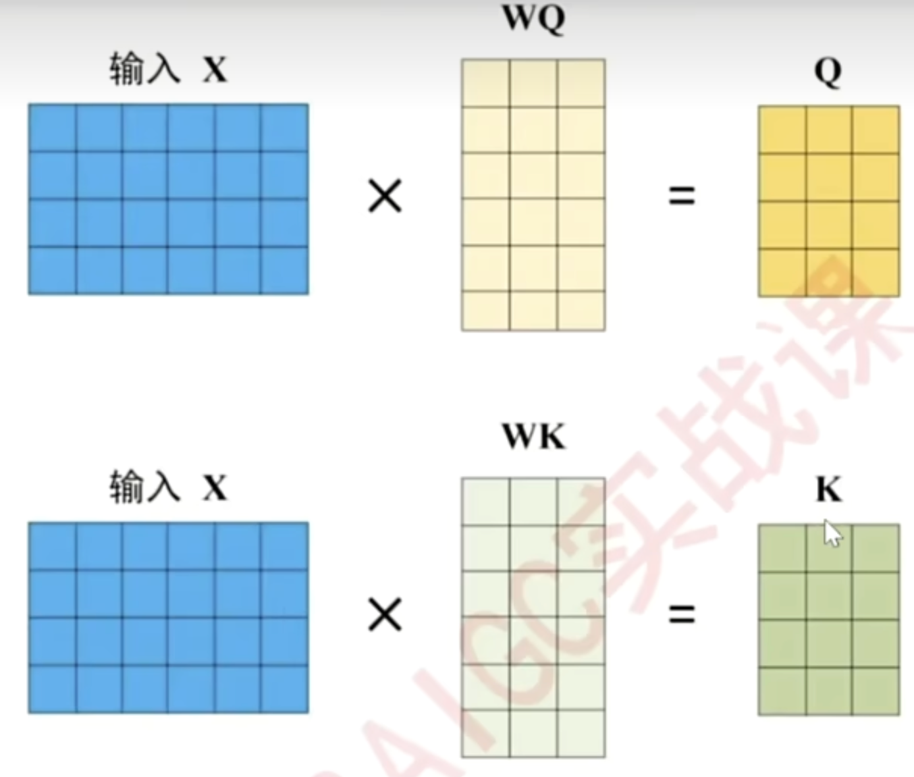

# Transformer
在序列算法的发展过程中, 核心问题已经由“如何建立样本之间的关联”转变为“如何合理地对样本进行加权求和, 即如何合理地求解样本加权过程中的权重”

最佳权重计算方式是注意力机制: ***Attention is all you need***

## 注意力机制
注意力机制通过计算样本与样本之间的相关性来判断**每个样本之于一个序列的重要程度**, 并给这些样本赋予能代表其重要性的权重

>经典注意力机制进行的是**跨序列**的样本的相关性计算. 这种形式常用于seq2seq任务, 如翻译
>
>但Transformer中使用的是自注意力机制, 考虑的是序列内部的样本之于序列本身的重要程度

### 注意力机制的原理

1.   如果能判断出**一个序列中哪些样本是重要的**, 就可以引导算法去重点学习更重要的样本
2.   **样本与样本之间的相关性**, 可以用来衡量一个样本对序列整体的重要性(与其他样本高相关的样本, 大概率会对序列整体的理解有重大影响)
3.   序列数据中的每个样本被编码成词向量, 因此样本与样本之间的相关性可以转化为**向量与向量之间的相关性**. 向量的相关性可以由点积来衡量
4.   但是, **样本之间的相关性需要体现与样本顺序的相关性**. 在语言中, 以一个单词为核心来计算相关性, 和以另一个单词为核心来计算相关性, 会得出不同的相关程度

### QKV矩阵
假设一个序列包含样本A和样本B, 那么样本之间的相关性就有AA, AB, BA, BB

其中, AB表示A询问(Question), B回答(Key)

设$X$为序列的特征矩阵, $X^T$为其转置, 则有:

$$
X = \begin{bmatrix}
A\\
B\\
\end{bmatrix}
$$
$$
X^T = \begin{bmatrix}
A^T
&B^T
\end{bmatrix}
$$
$$
X*X^T = \begin{bmatrix}
r_{AA} & r_{AB}  \\
r_{BA} & r_{BB
}  \\

\end{bmatrix}
$$
至此, 得到了所有样本之间的相关度

可以简单理解为, 询问矩阵Q就是特征矩阵X, 回答矩阵K就是特征矩阵X的转置

但是, 这样只能得到一组相关性, 为了得到更丰富的多组相关性, 我们需要做进一步的处理

在实际应用中, 为了得到语义的相关性而不是单纯的数字上的关系, 往往会现在**原始特征矩阵的基础上乘以一个解读语义的$w$参数矩阵**, 用以生成询问的矩阵Q、用于应答的矩阵K

其中, 参数矩阵$w$是神经网络的参数, 是由迭代得到的, 因此$w$会根据损失函数的需求不断地对原始特征矩阵进行语义解读

