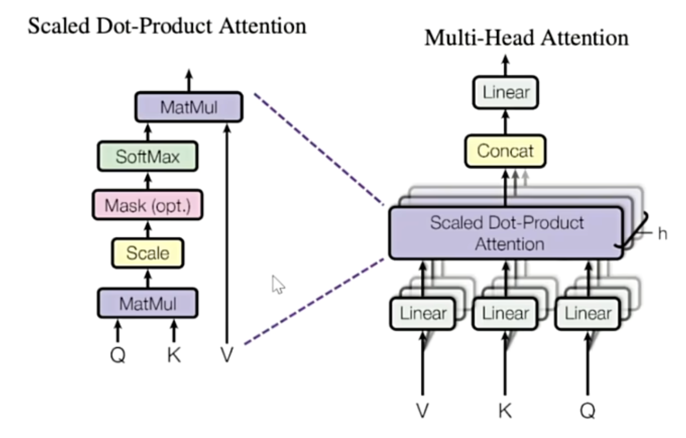
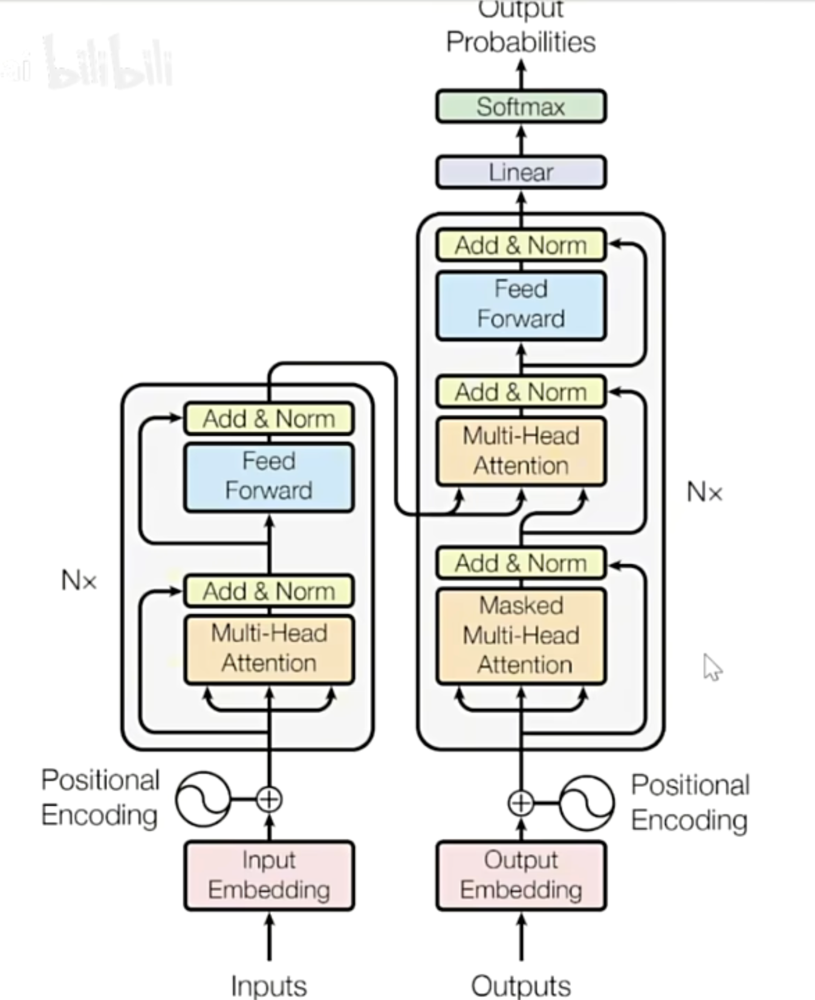

# Transformer
在序列算法的发展过程中, 核心问题已经由“如何建立样本之间的关联”转变为“如何合理地对样本进行加权求和, 即如何合理地求解样本加权过程中的权重”

最佳权重计算方式是注意力机制: ***Attention is all you need***

## 注意力机制
注意力机制通过计算样本与样本之间的相关性来判断**每个样本之于一个序列的重要程度**, 并给这些样本赋予能代表其重要性的权重

>经典注意力机制进行的是**跨序列**的样本的相关性计算. 这种形式常用于seq2seq任务, 如翻译
>
>但Transformer中使用的是自注意力机制, 考虑的是序列内部的样本之于序列本身的重要程度

### 注意力机制的原理

1.   如果能判断出**一个序列中哪些样本是重要的**, 就可以引导算法去重点学习更重要的样本
2.   **样本与样本之间的相关性**, 可以用来衡量一个样本对序列整体的重要性(与其他样本高相关的样本, 大概率会对序列整体的理解有重大影响)
3.   序列数据中的每个样本被编码成词向量, 因此样本与样本之间的相关性可以转化为**向量与向量之间的相关性**. 向量的相关性可以由点积来衡量
4.   但是, **样本之间的相关性需要体现与样本顺序的相关性**. 在语言中, 以一个单词为核心来计算相关性, 和以另一个单词为核心来计算相关性, 会得出不同的相关程度

### QKV矩阵
假设一个序列包含样本A和样本B, 那么样本之间的相关性就有AA, AB, BA, BB

其中, AB表示A询问(Question), B回答(Key)

设$X$为序列的特征矩阵, $X^T$为其转置, 则有:

$$
X = \begin{bmatrix}
A\\
B\\
\end{bmatrix}
$$
$$
X^T = \begin{bmatrix}
A^T
&B^T
\end{bmatrix}
$$
$$
X*X^T = \begin{bmatrix}
r_{AA} & r_{AB}  \\
r_{BA} & r_{BB
}  \\

\end{bmatrix}
$$
至此, 得到了所有样本之间的相关度

可以简单理解为, 询问矩阵Q就是特征矩阵X, 回答矩阵K就是特征矩阵X的转置

但是, 这样只能得到一组相关性, 为了得到更丰富的多组相关性, 我们需要做进一步的处理

在实际应用中, 为了得到语义的相关性而不是单纯的数字上的关系, 往往会现在**原始特征矩阵的基础上乘以一个解读语义的$w$参数矩阵**, 用以生成询问的矩阵Q、用于应答的矩阵K

其中, 参数矩阵$w$是神经网络的参数, 是由迭代得到的, 因此$w$会根据损失函数的需求不断地对原始特征矩阵进行语义解读

| **矩阵** | **作用**                             |
|----------|--------------------------------------|
| **Q**    | 查询（Query） → 提问（主动查询）     |
| **K**    | 键（Key） → 匹配（查找对应关系）     |
| **V**    | 值（Value） → 提供信息（被加权）     |

### Transformer中的注意力分数
Transformer中注意力机制的计算结果被称为注意力分数:

$$Attention(Q, K, V) = softmax(\frac{QK^T}{\sqrt{d_k}})V$$

*   其中$Q$和$K$由特征矩阵及其转置分别乘上参数矩阵$W_q$和$W_k$得到

*   $d_k$是特征的维度. 这里除以$\sqrt{d_k}$的作用是标准化(scaling), 防止随着特征维度的增加而导致点积无限大

*   $softmax$函数的作用是将值转化为$[0,1]$之间的概率分布, 并且使得一个样本与其他所有样本(包括其自身)的相关性总和为1(即AA+AB=1, BA+BB=1)
*   $V$代表的是原始特征矩阵的语义解读. $V$由参数矩阵$W_v$与原始的参数矩阵$X$相乘得到

### 多头注意力机制

即在初始化的时候就生成多组语义矩阵$W$($W_q, W_k, W_v$)

Transformer中使用的是8头注意力机制, 即一开始就会生成8*3=24个语义矩阵

每个头都会输出一组注意力分数, 最终的结果是将每个头的注意力分数拼接起来, 即:

对于 $h$ 个注意力头，每个头的输出$Z_i$ 为：

$$
Z_i = \begin{pmatrix}
z_{i1} & z_{i2} & z_{i3} \\
z_{i4} & z_{i5} & z_{i6}
\end{pmatrix}
$$

总拼接操作如下：

$$
Z_{\text{concatenated}} = \begin{pmatrix}
z_{11} & z_{12} & z_{13} & z_{21} & z_{22} & z_{23} & \cdots & z_{h1} & z_{h2} & z_{h3} \\
z_{14} & z_{15} & z_{16} & z_{24} & z_{25} & z_{26} & \cdots & z_{h4} & z_{h5} & z_{h6}
\end{pmatrix}
$$

之所以直接进行拼接, 是因为Transformer只能处理三维数据(batch_size, vocal_size, embedding_dimension)

如果再将n个头单独作为一个维度, 那么就变成四维数据了, 无法进行处理, 因此只能在embedding_dimension里直接进行拼接

## Transformer的结构

简单粗暴地理解:
-   编码层Encoder: 把文字转化成矩阵
-   解码层Decoder: 把矩阵转化成文字

**Encoder(可以有n个)**:
**注意力机制**->残差和(缓解梯度消失、避免性能退化、加速模型收敛)+标准化->**前馈神经网络**->残差和+标准化

*   在Transformer的经典结构中, Encoder层重复了6层

**Decoder**: **有掩码的注意力机制**(防泄漏)->残差和+标准化->**没有掩码的注意力机制**(*在这一步, 来自Decoder的矩阵是Q, 来自Encoder的两个矩阵分别是K和V*)->残差和+标准化->**前馈神经网络**->残差和+标准化

*   在Decoder层, 输入的是对标签进行embedding的结果
*   Decoder和Encoder的层数应该保持一致, 一般是6层
*   对于1-5层Encoder, 它们只会把编码好结果传递给下一层Encoder, 只有**第6层Encoder会把结果分别传递给6个Decoder**