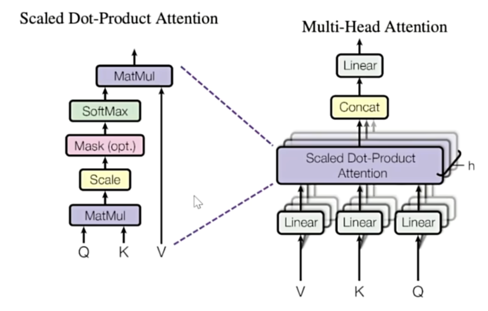
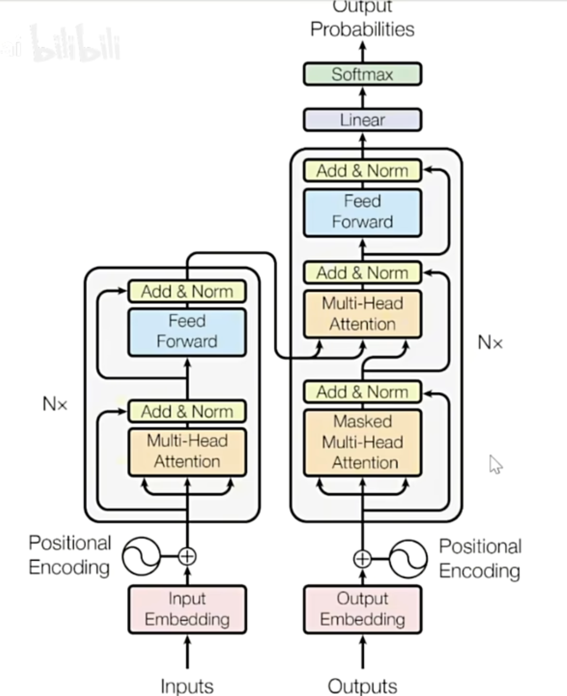
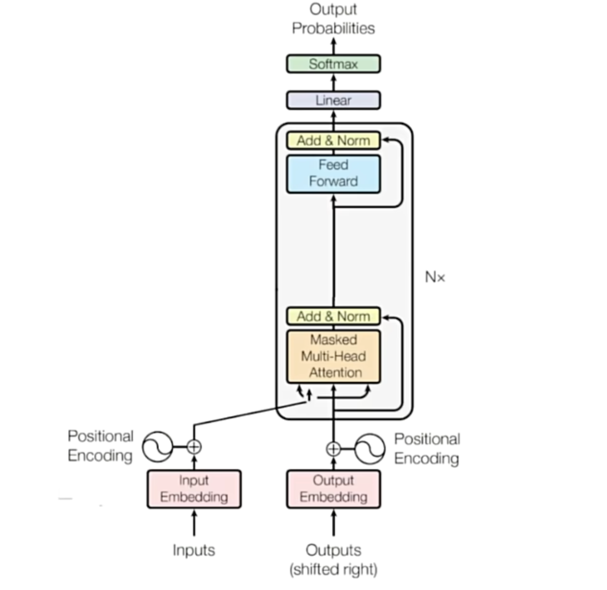

# Transformer
在序列算法的发展过程中, 核心问题已经由“如何建立样本之间的关联”转变为“如何合理地对样本进行加权求和, 即如何合理地求解样本加权过程中的权重”

最佳权重计算方式是注意力机制: ***Attention is all you need***

## 注意力机制
注意力机制通过计算样本与样本之间的相关性来判断**每个样本之于一个序列的重要程度**, 并给这些样本赋予能代表其重要性的权重

>经典注意力机制进行的是**跨序列**的样本的相关性计算. 这种形式常用于seq2seq任务, 如翻译
>
>但Transformer中使用的是自注意力机制, 考虑的是序列内部的样本之于序列本身的重要程度

### 注意力机制的原理

1.   如果能判断出**一个序列中哪些样本是重要的**, 就可以引导算法去重点学习更重要的样本
2.   **样本与样本之间的相关性**, 可以用来衡量一个样本对序列整体的重要性(与其他样本高相关的样本, 大概率会对序列整体的理解有重大影响)
3.   序列数据中的每个样本被编码成词向量, 因此样本与样本之间的相关性可以转化为**向量与向量之间的相关性**. 向量的相关性可以由点积来衡量
4.   但是, **样本之间的相关性需要体现与样本顺序的相关性**. 在语言中, 以一个单词为核心来计算相关性, 和以另一个单词为核心来计算相关性, 会得出不同的相关程度

### QKV矩阵
假设一个序列包含样本A和样本B, 那么样本之间的相关性就有AA, AB, BA, BB

其中, AB表示A询问(Question), B回答(Key)

设$X$为序列的特征矩阵, $X^T$为其转置, 则有:

$$
X = \begin{bmatrix}
A\\
B\\
\end{bmatrix}
$$

$$
X^T = \begin{bmatrix}
A^T
&B^T
\end{bmatrix}
$$

$$
X*X^T = \begin{bmatrix}
r_{AA} & r_{AB}  \\
r_{BA} & r_{BB
}  \\
\end{bmatrix}
$$
至此, 得到了所有样本之间的相关度

可以简单理解为, 询问矩阵Q就是特征矩阵X, 回答矩阵K就是特征矩阵X的转置

但是, 这样只能得到一组相关性, 为了得到更丰富的多组相关性, 我们需要做进一步的处理

在实际应用中, 为了得到语义的相关性而不是单纯的数字上的关系, 往往会现在**原始特征矩阵的基础上乘以一个解读语义的$w$参数矩阵**, 用以生成询问的矩阵Q、用于应答的矩阵K

其中, 参数矩阵$w$是神经网络的参数, 是由迭代得到的, 因此$w$会根据损失函数的需求不断地对原始特征矩阵进行语义解读

| **矩阵** | **作用**                             |
|----------|--------------------------------------|
| **Q**    | 查询（Query） → 提问（主动查询）     |
| **K**    | 键（Key） → 匹配（查找对应关系）     |
| **V**    | 值（Value） → 提供信息（被加权）     |


### Transformer中的注意力分数
Transformer中注意力机制的计算结果被称为注意力分数:

$$Attention(Q, K, V) = softmax(\frac{QK^T}{\sqrt{d_k}})V$$

*   其中$Q$和$K$由特征矩阵及其转置分别乘上参数矩阵$W_q$和$W_k$得到

*   $d_k$是特征的维度. 这里除以$\sqrt{d_k}$的作用是标准化(scaling), 防止随着特征维度的增加而导致点积无限大

*   $softmax$函数的作用是将值转化为$[0,1]$之间的概率分布, 并且使得一个样本与其他所有样本(包括其自身)的相关性总和为1(即AA+AB=1, BA+BB=1)
*   $V$代表的是原始特征矩阵的语义解读. $V$由参数矩阵$W_v$与原始的参数矩阵$X$相乘得到

### 多头注意力机制

即在初始化的时候就生成多组语义矩阵$W$($W_q, W_k, W_v$)

Transformer中使用的是8头注意力机制, 即一开始就会生成8*3=24个语义矩阵

每个头都会输出一组注意力分数, 最终的结果是将每个头的注意力分数拼接起来, 即:

对于 $h$ 个注意力头，每个头的输出$Z_i$ 为：

$$
Z_i = \begin{pmatrix}
z_{i1} & z_{i2} & z_{i3} \\
z_{i4} & z_{i5} & z_{i6}
\end{pmatrix}
$$

总拼接操作如下：

$$
Z_{\text{concatenated}} = \begin{pmatrix}
z_{11} & z_{12} & z_{13} & z_{21} & z_{22} & z_{23} & \cdots & z_{h1} & z_{h2} & z_{h3} \\
z_{14} & z_{15} & z_{16} & z_{24} & z_{25} & z_{26} & \cdots & z_{h4} & z_{h5} & z_{h6}
\end{pmatrix}
$$

之所以直接进行拼接, 是因为Transformer只能处理三维数据(batch_size, vocal_size, embedding_dimension)

如果再将n个头单独作为一个维度, 那么就变成四维数据了, 无法进行处理, 因此只能在里直接进行拼接, 是最终拼接完的结果等于`embedding_dimension`



## Transformer的结构


简单粗暴地理解:
-   编码层Encoder: 把文字转化成矩阵
-   解码层Decoder: 把矩阵转化成文字

**Encoder(可以有n个)**:
**注意力机制**->残差和(缓解梯度消失、避免性能退化、加速模型收敛)+标准化->**前馈神经网络**->残差和+标准化

*   在Transformer的经典结构中, Encoder层重复了6层

**Decoder**: **有掩码的注意力机制**(防泄漏)->残差和+标准化->**没有掩码的注意力机制**(*在这一步, 来自Decoder的矩阵是Q, 来自Encoder的两个矩阵分别是K和V*)->残差和+标准化->**前馈神经网络**->残差和+标准化

*   在Decoder层, 输入的是对标签进行embedding的结果
*   Decoder和Encoder的层数应该保持一致, 一般是6层
*   对于1-5层Encoder, 它们只会把编码好结果传递给下一层Encoder, 只有**第6层Encoder会把结果分别传递给6个Decoder**


**总结对比**

| **模型结构**         | **特点**                     | **典型应用场景**                   | **代表模型**              |
|-------------------|--------------------------|------------------------------|------------------------|
| **Encoder-Only**  | 专注于输入序列的表示           | 文本分类、序列标注、语义嵌入生成       | BERT, RoBERTa          |
| **Decoder-Only**  | 专注于序列生成（自回归方式）     | 文本生成、语言建模、对话系统           | GPT, GPT-3             |
| **Encoder+Decoder** | 处理序列到序列的转换任务         | 机器翻译、文本摘要、问答系统、图像描述生成 | Transformer, T5, BART |


*   GPT 将输入指令和目标输出拼接成一个连续序列, 通过自回归机制生成序列，逐步预测下一个标记，直到生成完整输出. 输入和输出是同一序列，不需要显式的编码器-解码器交互, 因此不是seq2seq类型

## Pytorch实现Transformer
### Encoder Only

Pytorch中没有完整的Transformer架构, 只有用于构建Transformer的各个层. (想完整使用最好用hugging face)

| **类名称**                        | **作用**                                                     |
|----------------------------------|------------------------------------------------------------|
| `nn.Transformer`                 | 不带输入与输出层的 Transformer 模型，同时具备编码器和解码器 |
| `nn.TransformerEncoder`          | Transformer 编码器的堆叠层，可以控制 Nx 的 N 的具体数字     |
| `nn.TransformerDecoder`          | Transformer 解码器的堆叠层，可以控制 Nx 的 N 的具体数字     |
| `nn.TransformerEncoderLayer`     | **Transformer 编码器层，由自注意力和前馈网络组成**  |
| `nn.TransformerDecoderLayer`     | **Transformer 解码器层，由自注意力、编码器-解码器注意力和前馈网络组成**|
| `nn.MultiheadAttention`          | 多头注意力机制                                              |
| `nn.LayerNorm`                   | 层归一化层                                                 |
| `nn.Embedding`                   | 嵌入层，用于将输入序列转换为嵌入表示                      |


`nn.TransformerEncoderLayer`的参数:

| **参数名**            | **说明**                                                                                                     |
|----------------------|------------------------------------------------------------------------------------------------------------|
| `d_model`            | 输入的嵌入维度（Embedding 过程中规定的特征维度），数学公式中的 $d_k$                                    |
| `nhead`              | 多头注意力机制中的头数，在代码中通常表示为 `num_heads`  **注意头数需要能被  $d_k$整除, 因为特征维度会根据头数进行切分**                                                |
| `dim_feedforward`    | 前馈网络的隐藏层维度，默认值为 2048                                                                         |
| `dropout`            | Dropout 概率，默认值 0.1。Transformer 中 Dropout 通常放置在自注意力层后、残差连接之前，前馈网络层后、残差连接之前, 主要是为了对抗过拟合 |
| `activation`         | 激活函数，默认值为 `relu`                                                                                   |
| `layer_norm_eps`     | 层归一化的 epsilon 值，默认值为 `1e-05`                                                                     |
| `batch_first`        | 如果为 `True`，则输入和输出张量的形状为 `(batch_size, seq_len, feature)`；否则为 `(seq_len, batch_size, feature)`。默认值为 `False` |
| `norm_first`         | 如果为 `True`，则执行前馈网络之前进行层归一化。默认值为 `False`                                             |
| `bias`              | 如果为 `True`，则在线性层中使用偏置。默认值为 `True`                                                       |
| `device`            | 指定层的设备，默认值为 `None`                                                                               |
| `dtype`             | 指定层的数据类型，默认值为 `None`                                                                           |
```python
import torch
import torch.nn as nn

# 定义 Transformer 编码器层
encoder_layer = nn.TransformerEncoderLayer(d_model=512, nhead=8, batch_first=True)

# 创建随机输入数据，形状为 (batch_size=32, seq_len=10, d_model=512)
src = torch.rand(32, 10, 512)

# 将输入数据通过编码器层
out = encoder_layer(src)
```

实例化后可以输入的内容有:

| **实例化后-参数名称**         | **说明**                                                                                       |
|-----------------------------|------------------------------------------------------------------------------------------------|
| `src`                       | 输入到编码器层的序列（**必填**）。                                                             |
| `src_mask`                  | 输入序列的掩码矩阵（**可选**），默认接收形状为 `(seq_len, seq_len)` 的二维矩阵。<br>通常该参数默认是执行**前瞻掩码**，在编码器（Encoder）中很少使用。 |
| `src_key_padding_mask`      | 输入序列的**填充掩码矩阵**（**可选**），默认接收形状为 `(batch_size, seq_len)` 的二维矩阵。<br>该参数仅用于**填充掩码**。 |

前瞻掩码和填充掩码的区别

| **对比维度**       | **填充掩码（Padding Mask）**                  | **前瞻掩码（Look-Ahead Mask）**                |
|------------------|--------------------------------------------|--------------------------------------------|
| **作用**         | 为了统一输入长度，短序列会在末尾或开头填充特殊符号, 因此在计算注意力时需要**屏蔽输入中的填充位**                              | 屏蔽未来的信息，防止模型“偷看”未来的内容         |
| **应用场景**     | 编码器和解码器（Encoder & Decoder）             | 主要用于解码器（Decoder）                    |
| **掩码矩阵形状** | `(batch_size, seq_len)`                      | `(seq_len, seq_len)`                      |
| **示例掩码**     | `[0, 0, 1, 1, 1]`（填充位为 1）               | 上三角矩阵（对角线以上为 -∞，对角线以下为 0）   |


```python
# 单一的编码器
encoder_layers = nn.TransformerEncoderLayer(
    d_model, 
    nhead, 
    dim_feedforward, 
    dropout, 
    batch_first=False
)

# 打包编码器
self.transformer_encoder = nn.TransformerEncoder(
    encoder_layers, 
    num_layers=num_encoder_layers
)

self.d_model = d_model

# 输出 - 线性层将编码器输出映射到目标维度（此处输出维度为1）
self.fc_out = nn.Linear(d_model, 1)

def forward(self, src, src_mask=None, src_key_padding_mask=None):
    # 第一步：进 embedding，输入数据结构应该是 (batch_size, seq_len)
    src = self.embedding(src) * torch.sqrt(torch.tensor(self.d_model, dtype=torch.float)) #这一步进行了scaling
    src = self.pos_encoder(src)  #位置编码
    
    # Transformer 编码器
    output = self.transformer_encoder(
        src, 
        mask=src_mask, 
        src_key_padding_mask=src_key_padding_mask
    )
    

    # 均值层 平均池化, 获得序列的固定长度表示; 如果Encoder的结果直接给Decoder用, 就不需要这一步
    # 平均池化指的是对某个维度额数据取平均值来代替该维度的变量, 从而达到降维的效果
    output = output.mean(dim=1)
    
    # 全连接层输出
    output = self.fc_out(output)
    
    return output
```

关于**平均池化**: 
 
维度变换与任务区别`(batch_size, seq_len, d_model)`

- `(2, 6, 512).mean(dim=1)`  ⟶  `(2, 512)`  
  **句子级特征**：只认句子，每个句子有 512 个维度的特征。

- `(2, 6, 512).mean(dim=0)`  ⟶  `(6, 512)`  
  **单词级特征**：只认单词，每个单词有 512 个维度的特征，不分句子。

- `(2, 6, 512)`  ⟶  **不变**  
  **句子和单词都考虑**：每个句子里的每个单词有 512 个维度。


### Decoder Only
Decoder-Only是专用于生成式任务的架构, 有独特的训练流程和结构



主要是移除了汇合编码解码信息的注意力层, 注意这里的input embedding一般是脱离要预测的序列之外的一些信息, 用来提供预测的background之类的

Decoder-Only主要采用自回归训练流程(模型通过依赖前面已经生成的部分来逐步生成后续的内容)

在自回归场景中, Decoder-Only的任务是:

*   利用序列的前半段预测序列的后半段
*   利用teaching force机制和自回归机制的本质, 在训练和预测流程中是用标签来辅助预测
    *   在**训练**流程中, 用**teaching force**机制, 不断将正确的标签作为特征数据使用, 这个过程不会累积错误
    *   在**测试**流程中, 用**自回归**属性, 将前一步的预测值作为特征数据来使用, 这个过程可能累积错误
  
  在生成式任务中, 一般不再区分“特征和标签”这两种不同的数据, 有且只有一种数据, 就是需要继续生成、继续补充的那段序列

  生成式任务带有**自监督属性**, 训练用的数据和要预测的数据来自同一段序列, 因此标签数据在下一个时间步就会成为我们的特征数据, 所以也不会再去区分特征和标签, 而是区分**输入和输出**

TransformerDncoderLayer和TransformerEncoderLayer的参数完全一致

需要注意的是:
*   encoder需要输入的是
    *   **inputs**
    *   **填充掩码**
*   decoder需要输入的是
    *   **outputs**(前一步生成内容)
    *   **memory**(来自encoder的信息)
    *   **target**(直接输入给decoder的信息, 仅在训练时使用)
    *   **填充掩码**(用于target, 一般不需要用于memory, 因为对于生成的memory信息无需再进行填充, 使用注意力机制会自动对齐)
    *   **前瞻掩码**(一般用于target, 很少用于memory)

### 实战注意点
在数据进入pytorch之前, 必须满足与pytorch兼容的格式要求:
1.   确保数据集拥有__len__方法和__getitem__方法
2.   数据应该是torch.Tensor类型
  
```python
# 兼容PyTorch，我们使用继承自Dataset的类
class TransformerDataset(Dataset):
    def __init__(self, data):
        # 初始化数据集，将传入的数据保存在实例变量data中
        self.data = data

    def __len__(self):
        # 返回数据集的大小
        return len(self.data)

    def __getitem__(self, i):
        # 根据索引i获取数据集中的第i个样本
        return self.data[i]
```

然后使用DataLoader对数据完成进一步的处理:
1.   完成batch的分割
2.   完成padding, 裁剪, 张量转化(list->tensor)等
3.   处理好标签y_true. 即使自监督学习不需要标签, 但在**计算损失函数的时候仍然需要标签**
     *   假设seq = [2, 5, 7, 8, 11], 那么对应的**y_true = [seq[1], seq[2], seq[3], seq[4], 0]** = [5, 7, 8, 11, 0] (填充0是因为在词汇表里**把0设置为unknown**; 如果0设置的不是unknown而是某个具体的词, 那么就需要填充别的数字)


```python
# 定义 collate_fn 函数，用于在 DataLoader 中对一个 batch 的数据进行处理
def collate_fn(examples):
    # 将每个样本的输入部分转换为张量
    seq = [torch.tensor(ex) for ex in examples]
    y_true = [torch.tensor(ex[1:] + [0]) for ex in examples]

    # pytorch 自带的 padding 工具
    # 对 batch 内的样本进行 padding，使其具有相同长度
    seq = pad_sequence(seq, batch_first=True)
    y_true = pad_sequence(y_true, batch_first=True)

    # 返回处理后的输入和目标
    return seq, y_true
```
 举例:

**seq = 这是最好的时代, 也是最坏的时代**

 经过带前瞻掩码的多头注意力机制后:

 **seq = [这, 这是, 这是最好的, 这是最好的时代, ...]**

所以: 

 **y_true = [是, 最好的, 时代, ...]**

## Hugging Face

| **特性**               | **Transformers (pipeline)**           | **Transformers (直接加载模型)**        | **vLLM**                                |
|------------------------|----------------------------------------|----------------------------------------|-----------------------------------------|
| **抽象层次**           | 高层封装，简单易用                     | 低层操作，自定义性强                    | 专注大规模优化，适合高效生产环境         |
| **内存管理**           | 依赖 Hugging Face 默认实现             | 依赖 Hugging Face 默认实现              | 动态内存分配，优化 GPU 使用              |
| **吞吐量**             | 中等，适合小批量推理                   | 中等，适合自定义任务                    | 高，支持并行推理，适合大规模任务         |
| **易用性**             | 操作简便，快速上手                     | 需要手动处理输入、输出和推理逻辑         | 使用略复杂，但高效处理大规模请求          |
| **适用场景**           | 快速原型开发、测试预训练模型           | 需要自定义逻辑或模型微调                | 高效生产部署、批量任务或低延迟应用       |
| **自动化支持**         | 自动完成预处理和后处理                 | 用户手动处理预处理和后处理              | 自动优化推理速度和内存占用              |
| **代码复杂度**         | 低                                     | 中                                      | 略高                                    |
| **示例场景**           | 小型测试和原型开发                     | 深度定制或微调模型                      | 批量生成、问答系统、大规模推理           |
