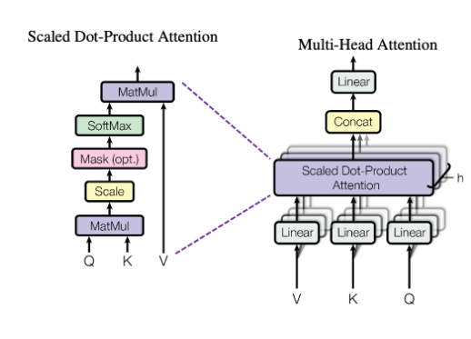
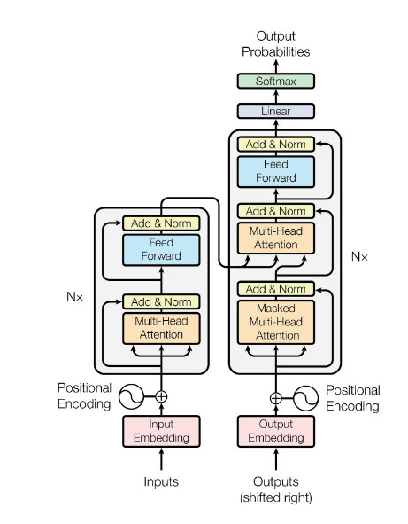
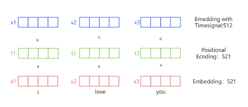
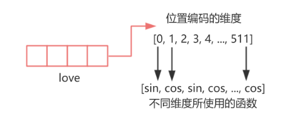
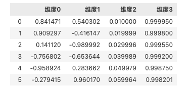
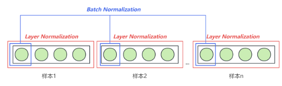

# Transformer
在序列算法的发展过程中, 核心问题已经由“如何建立样本之间的关联”转变为“如何合理地对样本进行加权求和, 即如何合理地求解样本加权过程中的权重”

最佳权重计算方式是注意力机制: ***Attention is all you need***

## 注意力机制
注意力机制通过计算样本与样本之间的相关性来判断**每个样本之于一个序列的重要程度**, 并给这些样本赋予能代表其重要性的权重

>经典注意力机制进行的是**跨序列**的样本的相关性计算. 这种形式常用于seq2seq任务, 如翻译
>
>但Transformer中使用的是自注意力机制, 考虑的是序列内部的样本之于序列本身的重要程度

### 注意力机制的原理

1.   如果能判断出**一个序列中哪些样本是重要的**, 就可以引导算法去重点学习更重要的样本
2.   **样本与样本之间的相关性**, 可以用来衡量一个样本对序列整体的重要性(与其他样本高相关的样本, 大概率会对序列整体的理解有重大影响)
3.   序列数据中的每个样本被编码成词向量, 因此样本与样本之间的相关性可以转化为**向量与向量之间的相关性**. 向量的相关性可以由点积来衡量
     *    **embedding过程如何确保相似的词点积更大**: Transformer的 embedding不是静态的, 也是可学习的参数, 可以在训练过程中不断优化. 通过大规模语料训练, 模型会自动调整embedding，使得相关词的点积更大、不相关词的点积更小
4.   但是, **样本之间的相关性需要体现与样本顺序的相关性**. 在语言中, 以一个单词为核心来计算相关性, 和以另一个单词为核心来计算相关性, 会得出不同的相关程度

### QKV矩阵
假设一个序列包含样本A和样本B, 那么样本之间的相关性就有AA, AB, BA, BB

其中, AB表示A询问(Question), B回答(Key)

设$X$为序列的特征矩阵, $X^T$为其转置, 则有:

$$
X = \begin{bmatrix}
A\\
B\\
\end{bmatrix}
$$

$$
X^T = \begin{bmatrix}
A^T
&B^T
\end{bmatrix}
$$

$$
X*X^T = \begin{bmatrix}
r_{AA} & r_{AB}  \\
r_{BA} & r_{BB
}  \\
\end{bmatrix}
$$
至此, 得到了所有样本之间的相关度

可以简单理解为, 询问矩阵Q就是特征矩阵X, 回答矩阵K就是特征矩阵X的转置

但是, 这样只能得到一组相关性, 为了得到更丰富的多组相关性, 我们需要做进一步的处理

在实际应用中, 为了得到语义的相关性而不是单纯的数字上的关系, 往往会现在**原始特征矩阵的基础上乘以一个解读语义的$w$参数矩阵**, 用以生成询问的矩阵Q、用于应答的矩阵K

其中, **参数矩阵$w$是神经网络的参数, 是由迭代得到的, 因此$w$会根据损失函数的需求不断地对原始特征矩阵进行语义解读**

**实际的相关性是在乘上语义矩阵后的Q和K之间进行的**. 这个过程就是自注意力机制的核心过程


| **矩阵** | **作用**                             |
|----------|--------------------------------------|
| **Q**    | 查询（Query） → 提问（主动查询）     |
| **K**    | 键（Key） → 匹配（查找对应关系）     |
| **V**    | 值（Value） → 提供信息（被加权）     |


### Transformer中的注意力分数
Transformer中注意力机制的计算结果被称为注意力分数:

$$Attention(Q, K, V) = softmax(\frac{QK^T}{\sqrt{d_k}})V$$

*   其中$Q$和$K$由特征矩阵及其转置分别乘上参数矩阵$W_q$和$W_k$得到

*   $d_k$是特征的维度. 这里除以$\sqrt{d_k}$的作用是标准化(scaling), 防止随着特征维度的增加而导致点积无限大

*   $softmax$函数的作用是将值转化为$[0,1]$之间的概率分布, 并且使得一个样本与其他所有样本(包括其自身)的相关性总和为1(即AA+AB=1, BA+BB=1, 即**矩阵每行之和 = 1**). 值此我们得到了想要的注意力分数, 也就是权重
*   矩阵$V$是transformer中特有的. $V$代表的是原始特征矩阵的语义解读. $V$由参数矩阵$W_v$与原始的参数矩阵$X$相乘得到
    $$
    \mathbf{r} = \begin{pmatrix}
    a_{11} & a_{12} \\
    a_{21} & a_{22}
    \end{pmatrix},
    \quad
    \mathbf{V} = \begin{pmatrix}
    v_{11} & v_{12} & v_{13} \\
    v_{21} & v_{22} & v_{23}
    \end{pmatrix}
    $$
    二者相乘的结果如下:
    $$
    \mathbf{Z(Attention)} = \begin{pmatrix}
    a_{11} & a_{12} \\
    a_{21} & a_{22}
    \end{pmatrix}
    \begin{pmatrix}
    v_{11} & v_{12} & v_{13} \\
    v_{21} & v_{22} & v_{23}
    \end{pmatrix}
    = \begin{pmatrix}
    (a_{11}v_{11} + a_{12}v_{21}) & (a_{11}v_{12} + a_{12}v_{22}) & (a_{11}v_{13} + a_{12}v_{23}) \\
    (a_{21}v_{11} + a_{22}v_{21}) & (a_{21}v_{12} + a_{22}v_{22}) & (a_{21}v_{13} + a_{22}v_{23})
    \end{pmatrix}
    $$

### 多头注意力机制

多头注意力机制指**将embedding维度切分为多个头, 每个头分别学习不同的投影矩阵(语义矩阵)**

- **对输入的 embedding 进行线性变换（投影）**  
  设输入的 token embedding 维度是 $d_{\text{model}}$，假设使用 $h$ 个注意力头，则每个头的维度是：
  $$
  d_{\text{head}} = \frac{d_{\text{model}}}{h}
  $$
  - 这意味着 embedding **不会膨胀**，只是被**切分成多个部分**。
  - 对输入 $X$ 进行不同的投影(乘语义矩阵)，得到不同的 **Query（Q）、Key（K）、Value（V）**：
    $$
    Q_i = X W^Q_i, \quad K_i = X W^K_i, \quad V_i = X W^V_i
    $$
    其中 $W^Q_i, W^K_i, W^V_i$ 是 **每个头不同的投影矩阵(语义矩阵)**，用于学习不同的语义特征。

- **计算注意力分数（Self-Attention）**  
  每个头独立进行注意力计算：
  $$
  \text{Attention}_i(Q_i, K_i, V_i) = \text{Softmax} \left( \frac{Q_i K_i^T}{\sqrt{d_{\text{head}}}} \right) V_i
  $$
  - 这里，每个头的注意力计算方式与普通 **Scaled Dot-Product Attention** 相同。
  - 由于每个头的投影矩阵不同，不同的头可能关注 **不同的语义关系**。

- **拼接多个头的输出（Concatenation）**  
  计算完 $h$ 个注意力后，所有头的结果拼接在一起：
  $$
  \text{MultiHead}(Q, K, V) = \text{Concat}(\text{head}_1, \text{head}_2, ..., \text{head}_h) W^O
  $$
  - 这里的 **拼接**（concatenation）操作不会改变 batch 维度，而是将多个头的输出合并。
  - 之后通过一个线性变换矩阵 $W^O$，让模型学习如何整合不同头的信息。

**Transformer使用的是8头注意力机制**

### Transformer的自注意力层



## Transformer的结构


简单粗暴地理解:
-   编码层Encoder: 收输入数据、负责提取特征
-   解码层Decoder: 负责输出最终的标签。当这个标签是自然语言的时候，解码器负责的是“将被处理后的信息还原回自然语言”，当这个标签是特定的类别或标签的时候，解码器负责的就是“整合信息输出统一结果”

**Encoder(可以有n个)**:
**注意力机制**->残差和(缓解梯度消失、避免性能退化、加速模型收敛)+标准化->**前馈神经网络**->残差和+标准化

*   在Transformer的经典结构中, Encoder层重复了6层

**Decoder**: **有掩码的注意力机制**(防泄漏)->残差和+标准化->**没有掩码的注意力机制**(*在这一步, 来自Decoder的矩阵是Q, 来自Encoder的两个矩阵分别是K和V*)->残差和+标准化->**前馈神经网络**->残差和+标准化

*   在Decoder层, 输入的是对标签进行embedding的结果
*   Decoder和Encoder的层数应该保持一致, 一般是6层
*   对于1-5层Encoder, 它们只会把编码好结果传递给下一层Encoder, 只有**第6层Encoder会把结果分别传递给6个Decoder**
*   在Decoder的多头注意力机制中, **来自Output传入的矩阵是Q, 而Encoder传入的两个矩阵是K和V**. 相当于由Output输入的标签进行询问, 而Encoder的内容进行回答


**总结对比**

| **模型结构**         | **特点**                     | **典型应用场景**                   | **代表模型**              |
|-------------------|--------------------------|------------------------------|------------------------|
| **Encoder-Only**  | 专注于输入序列的表示           | **情感分析**: 确定文本的情感倾向，如正面、负面或中性<br><br>**文本分类**: 垃圾邮件过滤、新闻分类等<br><br>**文本生成的预训练**      | BERT, RoBERTa          |
| **Decoder-Only**  | 专注于序列生成（自回归方式）     | **大语言模型**<br>**文本生成**<br>**代码补全**           | GPT, GPT-3             |
| **Encoder+Decoder** | 处理序列到序列的转换任务         | **机器翻译**<br>**文本摘要**<br>**问答系统**: 根据上下文回答用户的问题，或者给定一段文本，回答其中提到的具体问题<br>**图像描述生成** | Transformer, T5, BART |


*   GPT 将输入指令和目标输出拼接成一个连续序列, 通过自回归机制生成序列，逐步预测下一个标记，直到生成完整输出. 输入和输出是同一序列，不需要显式的编码器-解码器交互, 因此不是seq2seq类型

## Encoder的各个层
### Embedding层
文字并不能直接转化成高维向量, 而是需要先形成一个词汇表, 每个词汇对应一个第一无二的索引, 而后将索引映射成高维向量(现在huggingface上也可以直接从文字映射成高维向量)

**Embedding的结果是可以训练的**, 并不是一成不变的


### 位置编码Positional Encoding

与RNN和LSTM不同, Transformer并不以序列的方式逐步处理输入数据, 而是一次性处理整个序列, **因此Attention和Transformer缺乏顺序/位置信息**



*图上的维度应该都是512*

在Transformer模型中, 词嵌入和位置编码被相加, 然后输入到模型的第一层. 这样, Transformer就可以同时处理词语的语义和它在句子中的位置信息

为什么词嵌入和位置编码直接相加, 但位置编码的信息仍能被正确解析?
*   可以把位置编码看作是一种轻微的扰动，它对词嵌入施加了一个小的影响，让相同的词在不同位置上的输入有所不同
*   在计算自注意力分数时, 如果位置不同(位置编码不同), 即使单词相同(词嵌入向量相同), 计算出的Q和K仍然不同, 会导致不同的注意力权重. 这意味着位置信息不会丢失


#### 正余弦编码


具体来看，正余弦编码的公式如下：

- 正弦位置编码（Sinusoidal Positional Encoding）
$$PE_{(pos, 2i)} = \sin \left( \frac{pos}{10000^{\frac{2i}{d_{\text{model}}}}} \right) $$

- 余弦位置编码（Cosine Positional Encoding）
$$ PE_{(pos, 2i+1)} = \cos \left( \frac{pos}{10000^{\frac{2i}{d_{\text{model}}}}} \right) $$


其中
- **pos是我们编码的核心信息, 也就是位置信息**, 代表样本在序列中的位置
- $2i$和$2i+1$分别代表embedding矩阵中的偶数和奇数维度索引,我们对奇数列使用cos函数, 对偶数列使用sin函数
- $d_{\text{model}}$ 代表embedding后矩阵的总维度(比如512, 我们需要这个值来确保生成的位置编码长度和词嵌入向量的长度一样, 以便可以相加)


**正余弦编码的优点:**
1.   sin和cos值域有限, 可以**限制位置编码的大小**
2.   具有良好的泛化性, 可以适用于任何长度的序列
3.   不增加额外的训练参数
4.   通过**调节频率, 我们可以得到多种多样的sin和cos函数**, 从而可以将位置信息投射到每个维度都各具特色、各不相同的高维空间, 以形成对位置信息的更好的表示(这就是我们为什么不直接把cos(pos)复制512次)
5.   **特征编号小的特征**(512个特征中靠前的特征), 三角函数的频率较高, **变化越剧烈, 可以捕捉到样本与样本的位置之间本身的细节差异**; **特征编号大的特征**, 三角函数频率低, 变化较为平缓, 反应的是**样本与样本之间按顺序排列的全局趋势**
     *   如下图所示, 前两个特征正余弦编码后震荡比较剧烈, 完全看不出相邻位置之间有什么联系; 而后两位特征正余弦编码后和位置信息基本是保持同样的规律的
    

```python
import torch
import math

class PositionalEncoding(torch.nn.Module):
    def __init__(self, d_model, max_len=5000):
        """
        d_model: 词嵌入的维度
        max_len: 句子的最大长度
        """
        super(PositionalEncoding, self).__init__()

        # 创建一个形状为 (max_len, d_model) 的位置编码矩阵
        pe = torch.zeros(max_len, d_model)

        # 生成位置索引 (max_len, 1)，然后扩展到 (max_len, d_model/2)
        position = torch.arange(0, max_len, dtype=torch.float).unsqueeze(1)

        # 计算 div_term，控制不同维度的频率
        div_term = torch.exp(torch.arange(0, d_model, 2).float() * (-math.log(10000.0) / d_model))

        # 计算正弦和余弦位置编码
        pe[:, 0::2] = torch.sin(position * div_term)  # 偶数索引用 sin
        pe[:, 1::2] = torch.cos(position * div_term)  # 奇数索引用 cos

        # 扩展维度，变为 (1, max_len, d_model)，方便与 batch 维度对齐
        self.pe = pe.unsqueeze(0)

    def forward(self, x):
        """
        x: (batch_size, seq_len, d_model)
        """
        seq_len = x.size(1)  # 获取输入的序列长度
        return x + self.pe[:, :seq_len, :].to(x.device)  # 只取当前 batch 的长度部分，并添加到输入

# 测试代码
d_model = 16  # 词向量维度
max_len = 50  # 最大句子长度
pos_encoder = PositionalEncoding(d_model, max_len)

# 生成一个 (batch_size=2, seq_len=10, d_model=16) 的输入
x = torch.zeros(2, 10, d_model)

# 添加位置编码
x_with_pe = pos_encoder(x)
print(x_with_pe.shape)  # 预期输出: torch.Size([2, 10, 16])

```

### 残差连接

残差连接可以有效地避免梯度消失

### 层归一化Layer Normalization

归一化的作用:
1.   减少内部协方差偏移
2.   加快训练速度
3.   减少对初始值的依赖


transformer的输入数据格式: (`batch_size`, `vocal_size`, `input_dimensions`)

**Batch Normalization**是在同一个batch内, 对**不同样本**的各个特征维度进行归一化

**Layer Normalization**是对**同一个样本**的所有特征进行归一化



**为什么使用LN而不使用BN**:
1.   NLP中经常处理长度不同的句子, 对于长度小于vocal_size的句子来说, 后面的几个词对应的维度都是填充的0, 没有实际意义. 此时若再跨样本进行BN, 这些填充的0将会把平均值和方差带跑
2.   为了提升训练速度, 可能会把batch_size设置为一个很小的值, 此时BN会因为batch_size不足而受到限制
3.   在某些任务中, 模型会一个接一个地处理序列中的元素, 而不是整个batch一起处理, 此时BN就不再适用了


### 前馈网络: 提供非线性变换

前馈神经网络: 信息单向流动的网络

在Transformer当中, 实际上前馈神经网络就是**由线性层组成的深度神经网络结构**, 它的主要职责是对输入数据进行**非线性变换**, 同时也负责产生输出值(这使得Encoder Only可以直接输出预测的标签)

自注意力机制大多数是一个线性结构, **在前馈神经网络之前, transformer不具有非线性结构**

前馈神经网络的具体结构: **两个线性层之间夹有一个激活函数**

1. **第一层线性变换**: 
   $z_1 = xW_1 + b_1$
   - $x$ 是输入向量
   - $W_1$ 和 $b_1$ 是第一层的权重矩阵和偏置向量
     
2. **ReLU激活函数**: 
   $a_1 = \text{ReLU}(z_1) = \max(0, z_1)$
   - ReLU的作用是引入非线性, 使得网络能够学习更复杂的函数映射
       
3. **第二层线性变换**: 
   $z_2 = a_1W_2 + b_2$
   - $a_1$ 是经过ReLU激活后的中间表示
   - $W_2$ 和 $b_2$ 是第二层的权重矩阵和偏置向量
   - 最终输出 $z_2$ 是前馈神经网络的输出

合起来，前馈神经网络的完整表达式为: 
$$ FFN(x) = \max(0, xW_1 + b_1)W_2 + b_2 $$

### Encoder Only

Pytorch中没有完整的Transformer架构, 只有用于构建Transformer的各个层

`nn.TransformerEncoderLayer`的参数:

| **参数名**            | **说明**                                                                                                     |
|----------------------|------------------------------------------------------------------------------------------------------------|
| `d_model`            | 输入的嵌入维度（Embedding 过程中规定的特征维度），数学公式中的 $d_k$                                    |
| `nhead`              | 多头注意力机制中的头数，在代码中通常表示为 `num_heads`  **注意头数需要能被  $d_k$整除, 因为特征维度会根据头数进行切分**                                                |
| `dim_feedforward`    | 前馈网络的隐藏层维度，默认值为 2048                                                                         |
| `dropout`            | Dropout 概率，默认值 0.1。Transformer 中 Dropout 通常放置在自注意力层后、残差连接之前，前馈网络层后、残差连接之前, 主要是为了对抗过拟合 |
| `activation`         | 激活函数，默认值为 `relu`                                                                                   |
| `layer_norm_eps`     | 层归一化的 epsilon 值，默认值为 `1e-05`                                                                     |
| `batch_first`        | 如果为 `True`，则输入和输出张量的形状为 `(batch_size, seq_len, feature)`；否则为 `(seq_len, batch_size, feature)`。默认值为 `False` |
| `norm_first`         | 如果为 `True`，则执行前馈网络之前进行层归一化。默认值为 `False`                                             |
| `bias`              | 如果为 `True`，则在线性层中使用偏置。默认值为 `True`                                                       |
| `device`            | 指定层的设备，默认值为 `None`                                                                               |
| `dtype`             | 指定层的数据类型，默认值为 `None`                                                                           |
```python
import torch
import torch.nn as nn

# 定义 Transformer 编码器层
encoder_layer = nn.TransformerEncoderLayer(d_model=512, nhead=8, batch_first=True)

# 创建随机输入数据，形状为 (batch_size=32, seq_len=10, d_model=512)
src = torch.rand(32, 10, 512)

# 将输入数据通过编码器层
out = encoder_layer(src)
```

实例化后可以输入的内容有:

| **实例化后-参数名称**         | **说明**                                                                                       |
|-----------------------------|------------------------------------------------------------------------------------------------|
| `src`                       | 输入到编码器层的序列（**必填**）。                                                             |
| `src_mask`                  | 输入序列的掩码矩阵（**可选**），默认接收形状为 `(seq_len, seq_len)` 的二维矩阵。<br>通常该参数默认是执行**前瞻掩码**，在编码器（Encoder）中很少使用。 |
| `src_key_padding_mask`      | 输入序列的**填充掩码矩阵**（**可选**），默认接收形状为 `(batch_size, seq_len)` 的二维矩阵。<br>该参数仅用于**填充掩码**。 |


```python
# 单一的编码器
encoder_layers = nn.TransformerEncoderLayer(
    d_model, 
    nhead, 
    dim_feedforward, 
    dropout, 
    batch_first=False
)

# 打包编码器
self.transformer_encoder = nn.TransformerEncoder(
    encoder_layers, 
    num_layers=num_encoder_layers
)

self.d_model = d_model

# 输出 - 线性层将编码器输出映射到目标维度（此处输出维度为1）
self.fc_out = nn.Linear(d_model, 1)

def forward(self, src, src_mask=None, src_key_padding_mask=None):
    # 第一步：进 embedding，输入数据结构应该是 (batch_size, seq_len)
    src = self.embedding(src) * torch.sqrt(torch.tensor(self.d_model, dtype=torch.float)) #这一步进行了scaling
    src = self.pos_encoder(src)  #位置编码
    
    # Transformer 编码器
    output = self.transformer_encoder(
        src, 
        mask=src_mask, 
        src_key_padding_mask=src_key_padding_mask
    )
    

    # 均值层 平均池化, 获得序列的固定长度表示; 如果Encoder的结果直接给Decoder用, 就不需要这一步
    # 平均池化指的是对某个维度额数据取平均值来代替该维度的变量, 从而达到降维的效果
    output = output.mean(dim=1)
    
    # 全连接层输出
    output = self.fc_out(output)
    
    return output
```


## Decoder的各个层

### 输入与Teacher Forcing

 Decoder的输入是**滞后1个单位的标签矩阵**, 也就是: 

[y1, y2, y3, y4]->[NaN, y1, y2, y3, y4]

这样做是为了在开头插入序列起始标记(sos)->["sos", y1, y2, y3, y4]

对decoder输入来说, 序列起始标记sos是必须的, 序列结束标记eos不是必须的

在Seq2Seq任务的训练过程中, 由于Decoder结构会需要输入标签, 因此我们必须要准备三种不同的数据(1个特征2个标签: `X`->Encoder, `y`->Decoder, `y`->loss), 并进行如下的处理: 

1. **Encoder编码器输入**：`X`不需要添加起始标记和结束标记。
2. **Decoder解码器输入的标签**：`y`在目标序列前添加起始标记（SOS）。
3. **解码器用来计算损失函数loss的标签**：`y`在目标序列末尾添加结束标记（EOS）。

处理后的序列就是：

1.    **编码器输入**：`["这", "是", "最", "好", "的", "时", "代"]`
2.    **解码器输入的标签**：`["SOS", "it", "was", "the", "best", "of", "times"]`
3.    **解码器用来计算损失函数的标签**：`["it", "was", "the", "best", "of", "times", "EOS"]`

**Teacher Forcing**的本质: 在**训练**时, 利用序列A + 序列B的(**正确的**)前半段预测序列B的后半段, 这样避免了错误的累积

在**测试**和**推理**的过程中, 我们并没有真实的标签矩阵, 因此需要将上一个时间步**预测的结果(不一定正确)**作为Decoder需要的输入

**训练**流程如下(实际训练过程中第一步和第二步(以及其他n步)是**同时并行**的, 因此可以实现**一次性输出**所有预测词):

> - **第一步，输入ebd_X & ebd_y[0] >> 输出yhat[0]，对应真实标签y[0]**
<table>
  <tr>
    <td>
      <p>输入Encoder<br>特征矩阵</p>
      <table style="color:red;">
        <tr>
          <th>索引</th><th></th><th>y1</th><th>y2</th><th>y3</th><th>y4</th><th>y5</th>
        </tr>
        <tr>
          <td>0</td><td>这</td><td>0.1821</td><td>0.4000</td><td>0.2248</td><td>0.4440</td><td>0.7771</td>
        </tr>
        <tr>
          <td>1</td><td>是</td><td>0.1721</td><td>0.5030</td><td>0.8948</td><td>0.2385</td><td>0.0987</td>
        </tr>
        <tr>
          <td>2</td><td>最好的</td><td>0.1342</td><td>0.8297</td><td>0.2978</td><td>0.7120</td><td>0.2565</td>
        </tr>
        <tr>
          <td>3</td><td>时代</td><td>0.1248</td><td>0.5003</td><td>0.7559</td><td>0.4804</td><td>0.2593</td>
        </tr>
      </table>
    </td>
    <td>
      <p>输入Decoder<br>标签矩阵</p>
      <table>
        <tr>
          <th>索引</th><th></th><th>y1</th><th>y2</th><th>y3</th><th>y4</th><th>y5</th>
        </tr>
        <tr style="color:red;">
          <td>0</td><td>"sos"</td><td>0.5651</td><td>0.2220</td><td>0.5112</td><td>0.8543</td><td>0.1239</td>
        </tr>
        <tr>
          <td>1</td><td>It</td><td>0.5621</td><td>0.8920</td><td>0.7312</td><td>0.2543</td><td>0.1289</td>
        </tr>
        <tr>
          <td>2</td><td>was</td><td>0.2314</td><td>0.6794</td><td>0.9823</td><td>0.8452</td><td>0.3417</td>
        </tr>
        <tr>
          <td>3</td><td>the</td><td>0.4932</td><td>0.2045</td><td>0.7531</td><td>0.6582</td><td>0.9731</td>
        </tr>
        <tr>
          <td>4</td><td>best</td><td>0.8342</td><td>0.2987</td><td>0.7642</td><td>0.2154</td><td>0.9812</td>
        </tr>
        <tr>
          <td>5</td><td>of</td><td>0.3417</td><td>0.5792</td><td>0.4821</td><td>0.6721</td><td>0.1234</td>
        </tr>
        <tr>
          <td>6</td><td>times</td><td>0.2531</td><td>0.7345</td><td>0.9812</td><td>0.5487</td><td>0.2378</td>
        </tr>
      </table>
    </td>
    <td>
      <p>对应</p>
      ➡
    </td>
    <td>
      <p>真实标签y</p>
      <table>
        <tr>
          <th>索引</th><th></th>
        </tr>
        <tr style="color:blue;">
          <td>0</td><td>It</td>
        </tr>
        <tr>
          <td>1</td><td>was</td>
        </tr>
        <tr>
          <td>2</td><td>the</td>
        </tr>
        <tr>
          <td>3</td><td>best</td>
        </tr>
        <tr>
          <td>4</td><td>of</td>
        </tr>
        <tr>
          <td>5</td><td>times</td>
        </tr>
        <tr>
          <td>6</td><td>"eos"</td>
        </tr>
      </table>
    </td>
  </tr>
</table>

> - **第二步，输入ebd_X & ebd_y[:1] >> 输出yhat[1]，对应真实标签y[1]**

<table>
  <tr>
    <td>
      <p>输入Encoder<br>特征矩阵</p>
      <table style="color:red;">
        <tr>
          <th>索引</th><th></th><th>y1</th><th>y2</th><th>y3</th><th>y4</th><th>y5</th>
        </tr>
        <tr>
          <td>0</td><td>这</td><td>0.1821</td><td>0.4000</td><td>0.2248</td><td>0.4440</td><td>0.7771</td>
        </tr>
        <tr>
          <td>1</td><td>是</td><td>0.1721</td><td>0.5030</td><td>0.8948</td><td>0.2385</td><td>0.0987</td>
        </tr>
        <tr>
          <td>2</td><td>最好的</td><td>0.1342</td><td>0.8297</td><td>0.2978</td><td>0.7120</td><td>0.2565</td>
        </tr>
        <tr>
          <td>3</td><td>时代</td><td>0.1248</td><td>0.5003</td><td>0.7559</td><td>0.4804</td><td>0.2593</td>
      </table>
    </td>
    <td>
      <p>输入Decoder<br>标签矩阵</p>
      <table>
        <tr>
          <th>索引</th><th></th><th>y1</th><th>y2</th><th>y3</th><th>y4</th><th>y5</th>
        </tr>
        <tr style="color:red;">
          <td>0</td><td>"sos"</td><td>0.5651</td><td>0.2220</td><td>0.5112</td><td>0.8543</td><td>0.1239</td>
        </tr>
        <tr style="color:red;">
          <td>1</td><td>It</td><td>0.5621</td><td>0.8920</td><td>0.7312</td><td>0.2543</td><td>0.1289</td>
        </tr>
        <tr>
          <td>2</td><td>was</td><td>0.2314</td><td>0.6794</td><td>0.9823</td><td>0.8452</td><td>0.3417</td>
        </tr>
        <tr>
          <td>3</td><td>the</td><td>0.4932</td><td>0.2045</td><td>0.7531</td><td>0.6582</td><td>0.9731</td>
        </tr>
        <tr>
          <td>4</td><td>best</td><td>0.8342</td><td>0.2987</td><td>0.7642</td><td>0.2154</td><td>0.9812</td>
        </tr>
        <tr>
          <td>5</td><td>of</td><td>0.3417</td><td>0.5792</td><td>0.4821</td><td>0.6721</td><td>0.1234</td>
        </tr>
        <tr>
          <td>6</td><td>times</td><td>0.2531</td><td>0.7345</td><td>0.9812</td><td>0.5487</td><td>0.2378</td>
        </tr>
      </table>
    </td>
    <td>
        <p>对应</p>
      ➡
    </td>
    <td>
      <p>真实标签y</p>
      <table>
        <tr>
          <th>索引</th><th></th>
        </tr>
        <tr>
          <td>0</td><td>It</td>
        </tr>
        <tr style="color:blue;">
          <td>1</td><td>was</td>
        </tr>
        <tr>
          <td>2</td><td>the</td>
        </tr>
        <tr>
          <td>3</td><td>best</td>
        </tr>
        <tr>
          <td>4</td><td>of</td>
        </tr>
        <tr>
          <td>5</td><td>times</td>
        </tr>
        <tr>
          <td>6</td><td>"eos"</td>
        </tr>
      </table>
    </td>
  </tr>
</table>

### 掩码注意力机制


transformer的掩码机制不让模型看到未来的信息, 是通过**将未来位置的注意力分数设置为0**来实现的


基本的注意力公式如下：

$$Attention(Q,K,V) = softmax(\frac{QK^{T}}{\sqrt{d_k}})V$$

在这个公式的基础上引入掩码功能，则涉及到下面的改变：

1. 在计算 $QK^T$ 的点积后，但在应用softmax函数之前，**掩码自注意力机制通过加上一个掩码矩阵来修改这个点积结果**。这个掩码矩阵有特定的结构: 对于不应该被当前位置注意的所有位置(即未来的位置), 掩码会赋予一个非常大的负值(如负无穷).掩码矩阵与原始$QK^T$点积进行**加和**(不是相乘!)，然后再将加和结果放入softmax函数
2. 应用softmax函数：**当softmax函数应用于经过掩码处理的点积矩阵时，那些被掩码覆盖的位置（即未来的位置）的权重实际上会接近于零**。这是因为 e 的非常大的负数次幂几乎为零


具体矩阵表示如下:
- **没有掩码时的$QK^T$点积**（此时的Q、K都是从输出矩阵中生成的）<br><br>
$$
QK^T = \begin{bmatrix}
       q_1 \cdot k_1^T & q_1 \cdot k_2^T & \cdots & q_1 \cdot k_n^T \\
       q_2 \cdot k_1^T & q_2 \cdot k_2^T & \cdots & q_2 \cdot k_n^T \\
       \vdots & \vdots & \ddots & \vdots \\
       q_n \cdot k_1^T & q_n \cdot k_2^T & \cdots & q_n \cdot k_n^T
     \end{bmatrix}
$$

- **没有掩码时softmax函数结果**<br><br>
$$
softmax(QK^T) = \begin{bmatrix}
       \frac{e^{q_1 \cdot k_1^T}}{\sum_{j=1}^n e^{q_1 \cdot k_j^T}} & \frac{e^{q_1 \cdot k_2^T}}{\sum_{j=1}^n e^{q_1 \cdot k_j^T}} & \cdots & \frac{e^{q_1 \cdot k_n^T}}{\sum_{j=1}^n e^{q_1 \cdot k_j^T}} \\
       \frac{e^{q_2 \cdot k_1^T}}{\sum_{j=1}^n e^{q_2 \cdot k_j^T}} & \frac{e^{q_2 \cdot k_2^T}}{\sum_{j=1}^n e^{q_2 \cdot k_j^T}} & \cdots & \frac{e^{q_2 \cdot k_n^T}}{\sum_{j=1}^n e^{q_2 \cdot k_j^T}} \\
       \vdots & \vdots & \ddots & \vdots \\
       \frac{e^{q_n \cdot k_1^T}}{\sum_{j=1}^n e^{q_n \cdot k_j^T}} & \frac{e^{q_n \cdot k_2^T}}{\sum_{j=1}^n e^{q_n \cdot k_j^T}} & \cdots & \frac{e^{q_n \cdot k_n^T}}{\sum_{j=1}^n e^{q_n \cdot k_j^T}}
     \end{bmatrix}
$$

- **掩码矩阵**<br><br>
$$
M = \begin{bmatrix}
       0 & -\infty & -\infty & \cdots & -\infty \\
       0 & 0 & -\infty & \cdots & -\infty \\
       0 & 0 & 0 & \cdots & -\infty \\
       \vdots & \vdots & \vdots & \ddots & \vdots \\
       0 & 0 & 0 & \cdots & 0
     \end{bmatrix}
  $$

在进行掩码时，用掩码矩阵与原始$QK^T$点积进行**加和**(不是相乘!)，然后再将加和结果放入softmax函数。

- **有掩码时, 掩码矩阵对原始$QK^T$矩阵的影响**

$$
QK^T + M = \begin{bmatrix}
       q_1 \cdot k_1^T + 0 & q_1 \cdot k_2^T - \infty & \cdots & q_1 \cdot k_n^T - \infty \\
       q_2 \cdot k_1^T + 0 & q_2 \cdot k_2^T + 0 & \cdots & q_2 \cdot k_n^T - \infty \\
       \vdots & \vdots & \ddots & \vdots \\
       q_n \cdot k_1^T + 0 & q_n \cdot k_2^T + 0 & \cdots & q_n \cdot k_n^T + 0 \end{bmatrix}
$$

$$= \begin{bmatrix}
       q_1 \cdot k_1^T & -\infty & -\infty & \cdots & -\infty \\
       q_2 \cdot k_1^T & q_2 \cdot k_2^T & -\infty & \cdots & -\infty \\
       \vdots & \vdots & \ddots & \vdots & -\infty \\
       q_n \cdot k_1^T & q_n \cdot k_2^T & \cdots & q_n \cdot k_{n-1}^T & q_n \cdot k_n^T
\end{bmatrix}
$$

- **有掩码时, 应用softmax函数后**

$$
\text{softmax}(QK^T + M) = \begin{bmatrix}
       \frac{e^{q_1 \cdot k_1^T}}{e^{q_1 \cdot k_1^T}} & 0 & 0 & 0 \\
       \frac{e^{q_2 \cdot k_1^T}}{e^{q_2 \cdot k_1^T} + e^{q_2 \cdot k_2^T}} & \frac{e^{q_2 \cdot k_2^T}}{e^{q_2 \cdot k_1^T} + e^{q_2 \cdot k_2^T}} & 0 & 0 \\
       \frac{e^{q_3 \cdot k_1^T}}{e^{q_3 \cdot k_1^T} + e^{q_3 \cdot k_2^T} + e^{q_3 \cdot k_3^T}} & \frac{e^{q_3 \cdot k_2^T}}{e^{q_3 \cdot k_1^T} + e^{q_3 \cdot k_2^T} + e^{q_3 \cdot k_3^T}} & \frac{e^{q_3 \cdot k_3^T}}{e^{q_3 \cdot k_1^T} + e^{q_3 \cdot k_2^T} + e^{q_3 \cdot k_3^T}} & 0 \\
       \frac{e^{q_4 \cdot k_1^T}}{\sum_{j=1}^{4} e^{q_4 \cdot k_j^T}} & \frac{e^{q_4 \cdot k_2^T}}{\sum_{j=1}^{4} e^{q_4 \cdot k_j^T}} & \frac{e^{q_4 \cdot k_3^T}}{\sum_{j=1}^{4} e^{q_4 \cdot k_j^T}} & \frac{e^{q_4 \cdot k_4^T}}{\sum_{j=1}^{4} e^{q_4 \cdot k_j^T}}
     \end{bmatrix}
$$


- **Decoder中，多头注意力机制输出的softmax结果**（这部分信息来自于真实标签y）

$$
\text{softmax}(QK^T + M) = \begin{bmatrix}
a_{11} & 0 & 0 & 0 \\
a_{21} & a_{22} & 0 & 0 \\
a_{31} & a_{32} & a_{33} & 0 \\
a_{41} & a_{42} & a_{43} & a_{44}
\end{bmatrix}
$$

$$
V = \begin{bmatrix}
v_{1}^1 & v_{1}^2 & \ldots & v_{1}^d \\
v_{2}^1 & v_{2}^2 & \ldots & v_{2}^d \\
v_{3}^1 & v_{3}^2 & \ldots & v_{3}^d \\
v_{4}^1 & v_{4}^2 & \ldots & v_{4}^d
\end{bmatrix}
$$

$$
C = \begin{bmatrix}
a_{11} & 0 & 0 & 0 \\
a_{21} & a_{22} & 0 & 0 \\
a_{31} & a_{32} & a_{33} & 0 \\
a_{41} & a_{42} & a_{43} & a_{44}
\end{bmatrix}
\begin{bmatrix}
v_{1}^1 & v_{1}^2 & \ldots & v_{1}^d \\
v_{2}^1 & v_{2}^2 & \ldots & v_{2}^d \\
v_{3}^1 & v_{3}^2 & \ldots & v_{3}^d \\
v_{4}^1 & v_{4}^2 & \ldots & v_{4}^d
\end{bmatrix}
$$

$$
C = \begin{bmatrix}
a_{11}v_{1}^1 & a_{11}v_{1}^2 & \ldots & a_{11}v_{1}^d \\
a_{21}v_{1}^1 + a_{22}v_{2}^1 & a_{21}v_{1}^2 + a_{22}v_{2}^2 & \ldots & a_{21}v_{1}^d + a_{22}v_{2}^d \\
a_{31}v_{1}^1 + a_{32}v_{2}^1 + a_{33}v_{3}^1 & a_{31}v_{1}^2 + a_{32}v_{2}^2 + a_{33}v_{3}^2 & \ldots & a_{31}v_{1}^d + a_{32}v_{2}^d + a_{33}v_{3}^d \\
a_{41}v_{1}^1 + a_{42}v_{2}^1 + a_{43}v_{3}^1 + a_{44}v_{4}^1 & a_{41}v_{1}^2 + a_{42}v_{2}^2 + a_{43}v_{3}^2 + a_{44}v_{4}^2 & \ldots & a_{41}v_{1}^d + a_{42}v_{2}^d + a_{43}v_{2}^d + a_{44}v_{4}^d
\end{bmatrix}
$$


### 前瞻掩码和填充掩码

前瞻掩码不是对QK的点积进行操作, 而是**对标签y进行操作**, 即逐步屏蔽输入标签的个数


前瞻掩码和填充掩码的区别

| **对比维度**       | **填充掩码（Padding Mask）**                  | **前瞻掩码（Look-Ahead Mask）**                |
|------------------|--------------------------------------------|--------------------------------------------|
| **作用**         | 为了统一输入长度，短序列会在末尾或开头填充特殊符号, 因此在计算注意力时需要**屏蔽输入中的填充位**                              | 屏蔽未来的信息，防止模型“偷看”未来的内容         |
| **应用场景**     | 编码器和解码器（Encoder & Decoder）             | 主要用于解码器（Decoder）                    |
| **掩码矩阵形状** | `(batch_size, seq_len)`                      | `(seq_len, seq_len)`                      |
| **示例掩码**     | `[0, 0, 1, 1, 1]`（填充位为 1）               | 上三角矩阵（对角线以上为 -∞，对角线以下为 0）   |


### 编码器 - 解码器注意力层(交叉注意力层)

从**Decoder带掩码的多头注意力层**输出的结果为(为了简化表示, 仅使用覆盖的时间点来作为脚标): 

$$
C_{decoder} = \begin{bmatrix}
c_{1} & c_{1} & \ldots & c_{1} \\
c_{1 \to 2} & c_{1 \to 2} & \ldots & c_{1 \to 2} \\
c_{1 \to 3} & c_{1 \to 3} & \ldots & c_{1 \to 3} \\
c_{1 \to 4} & c_{1 \to 4} & \ldots & c_{1 \to 4}
\end{bmatrix}
$$

从**Encoder**中输出的是没有掩码的注意力机制结果$C_{encoder}$，由于没有掩码，所以Encoder中的注意力分数为——

$$
\text{A} = \begin{bmatrix}
a_{11} & a_{12} & a_{13} & a_{14} \\
a_{21} & a_{22} & a_{23} & a_{24} \\
a_{31} & a_{32} & a_{33} & a_{34} \\
a_{41} & a_{42} & a_{43} & a_{44}
\end{bmatrix}
$$

同时, Encoder输出的V矩阵为

$$
V = \begin{bmatrix}
v_{1} & v_{1} & \ldots & v_{1} \\
v_{2} & v_{2} & \ldots & v_{2} \\
v_{3} & v_{3} & \ldots & v_{3} \\
v_{4} & v_{4} & \ldots & v_{4}
\end{bmatrix}
$$

$$
C_{encoder}  = \text{A} \times V= \begin{bmatrix}
c_{1 \to 4} & c_{1 \to 4} & \ldots & c_{1 \to 4} \\
c_{1 \to 4} & c_{1 \to 4} & \ldots & c_{1 \to 4} \\
c_{1 \to 4} & c_{1 \to 4} & \ldots & c_{1 \to 4} \\
c_{1 \to 4} & c_{1 \to 4} & \ldots & c_{1 \to 4}
\end{bmatrix}
$$

在交叉注意力层, 有$C_{decoder}$->$Q$, $C_{encoder}$->$K$&$V$, **使用每行Q与K、V的所有列相乘**，来执行一种特殊的注意力机制, 即


$$\text{Context}_1 = \sum_{i} \text{Attention}(Q_1, K_i) \times V_i$$

$$\text{Context}_2 = \sum_{i} \text{Attention}(Q_2, K_i) \times V_i$$

$$\text{Context}_3 = \sum_{i} \text{Attention}(Q_3, K_i) \times V_i$$

$$……$$

即:
$$
Context_1 = \begin{bmatrix}
\color{red}{c_{1}} & \color{red}{c_{1}} & \ldots & \color{red}{c_{1}} \\
c_{1 \to 2} & c_{1 \to 2} & \ldots & c_{1 \to 2} \\
c_{1 \to 3} & c_{1 \to 3} & \ldots & c_{1 \to 3} \\
c_{1 \to 4} & c_{1 \to 4} & \ldots & c_{1 \to 4}
\end{bmatrix} \cdot 
\begin{bmatrix}
\color{red}{c_{1 \to 4}} & c_{1 \to 4} & \ldots & c_{1 \to 4} \\
\color{red}{c_{1 \to 4}} & c_{1 \to 4} & \ldots & c_{1 \to 4} \\
\color{red}{c_{1 \to 4}} & c_{1 \to 4} & \ldots & c_{1 \to 4} \\
\color{red}{c_{1 \to 4}} & c_{1 \to 4} & \ldots & c_{1 \to 4}
\end{bmatrix}
$$

$$ + $$

$$
\begin{bmatrix}
\color{red}{c_{1}} & \color{red}{c_{1}} & \ldots & \color{red}{c_{1}} \\
c_{1 \to 2} & c_{1 \to 2} & \ldots & c_{1 \to 2} \\
c_{1 \to 3} & c_{1 \to 3} & \ldots & c_{1 \to 3} \\
c_{1 \to 4} & c_{1 \to 4} & \ldots & c_{1 \to 4}
\end{bmatrix} \cdot
\begin{bmatrix}
c_{1 \to 4} & \color{red}{c_{1 \to 4}} & \ldots & c_{1 \to 4} \\
c_{1 \to 4} & \color{red}{c_{1 \to 4}} & \ldots & c_{1 \to 4} \\
c_{1 \to 4} & \color{red}{c_{1 \to 4}} & \ldots & c_{1 \to 4} \\
c_{1 \to 4} & \color{red}{c_{1 \to 4}} & \ldots & c_{1 \to 4}
\end{bmatrix}
$$

$$ + $$

$$ …… $$

$$ + $$

$$
\begin{bmatrix}
\color{red}{c_{1}} & \color{red}{c_{1}} & \ldots & \color{red}{c_{1}} \\
c_{1 \to 2} & c_{1 \to 2} & \ldots & c_{1 \to 2} \\
c_{1 \to 3} & c_{1 \to 3} & \ldots & c_{1 \to 3} \\
c_{1 \to 4} & c_{1 \to 4} & \ldots & c_{1 \to 4}
\end{bmatrix} \cdot
\begin{bmatrix}
c_{1 \to 4} & c_{1 \to 4} & \ldots & \color{red}{c_{1 \to 4}} \\
c_{1 \to 4} & c_{1 \to 4} & \ldots & \color{red}{c_{1 \to 4}} \\
c_{1 \to 4} & c_{1 \to 4} & \ldots & \color{red}{c_{1 \to 4}} \\
c_{1 \to 4} & c_{1 \to 4} & \ldots & \color{red}{c_{1 \to 4}}
\end{bmatrix}
$$

这个流程正是为了实现利用序列X(矩阵KV的每一列) + 序列y的前半段预测序列y的后半段的**并行**计算


### Decoder Only
Decoder-Only是专用于生成式任务的架构, 有独特的训练流程和结构


主要是移除了汇合编码解码信息的注意力层, 注意这里的input embedding一般是脱离要预测的序列之外的一些信息, 用来提供预测的background之类的

Decoder-Only主要采用自回归训练流程(模型通过依赖前面已经生成的部分来逐步生成后续的内容)

在自回归场景中, Decoder-Only的任务是:

*   利用序列的前半段预测序列的后半段
*   利用teaching force机制和自回归机制的本质, 在训练和预测流程中是用标签来辅助预测
    *   在**训练**流程中, 用**teaching force**机制, 不断将正确的标签作为特征数据使用, 这个过程不会累积错误
    *   在**测试**流程中, 用**自回归**属性, 将前一步的预测值作为特征数据来使用, 这个过程可能累积错误
  
  在生成式任务中, 一般不再区分“特征和标签”这两种不同的数据, 有且只有一种数据, 就是需要继续生成、继续补充的那段序列

  生成式任务带有**自监督属性**, 训练用的数据和要预测的数据来自同一段序列, 因此标签数据在下一个时间步就会成为我们的特征数据, 所以也不会再去区分特征和标签, 而是区分**输入和输出**

TransformerDncoderLayer和TransformerEncoderLayer的参数完全一致

需要注意的是:
*   encoder需要输入的是
    *   **inputs**
    *   **填充掩码**
*   decoder需要输入的是
    *   **outputs**(前一步生成内容)
    *   **memory**(来自encoder的信息)
    *   **target**(直接输入给decoder的信息, 仅在训练时使用)
    *   **填充掩码**(用于target, 一般不需要用于memory, 因为对于生成的memory信息无需再进行填充, 使用注意力机制会自动对齐)
    *   **前瞻掩码**(一般用于target, 很少用于memory)

### 实战注意点
在数据进入pytorch之前, 必须满足与pytorch兼容的格式要求:
1.   确保数据集拥有__len__方法和__getitem__方法
2.   数据应该是torch.Tensor类型
  
```python
# 兼容PyTorch，我们使用继承自Dataset的类
class TransformerDataset(Dataset):
    def __init__(self, data):
        # 初始化数据集，将传入的数据保存在实例变量data中
        self.data = data

    def __len__(self):
        # 返回数据集的大小
        return len(self.data)

    def __getitem__(self, i):
        # 根据索引i获取数据集中的第i个样本
        return self.data[i]
```

然后使用DataLoader对数据完成进一步的处理:
1.   完成batch的分割
2.   完成padding, 裁剪, 张量转化(list->tensor)等
3.   处理好标签y_true. 即使自监督学习不需要标签, 但在**计算损失函数的时候仍然需要标签**
     *   假设seq = [2, 5, 7, 8, 11], 那么对应的**y_true = [seq[1], seq[2], seq[3], seq[4], 0]** = [5, 7, 8, 11, 0] (填充0是因为在词汇表里**把0设置为unknown**; 如果0设置的不是unknown而是某个具体的词, 那么就需要填充别的数字)


```python
# 定义 collate_fn 函数，用于在 DataLoader 中对一个 batch 的数据进行处理
def collate_fn(examples):
    # 将每个样本的输入部分转换为张量
    seq = [torch.tensor(ex) for ex in examples]
    y_true = [torch.tensor(ex[1:] + [0]) for ex in examples]

    # pytorch 自带的 padding 工具
    # 对 batch 内的样本进行 padding，使其具有相同长度
    seq = pad_sequence(seq, batch_first=True)
    y_true = pad_sequence(y_true, batch_first=True)

    # 返回处理后的输入和目标
    return seq, y_true
```
 举例:

**seq = 这是最好的时代, 也是最坏的时代**

 经过带前瞻掩码的多头注意力机制后:

 **seq = [这, 这是, 这是最好的, 这是最好的时代, ...]**

所以: 

 **y_true = [是, 最好的, 时代, ...]**

## Hugging Face

| **特性**               | **Transformers (pipeline)**           | **Transformers (直接加载模型)**        | **vLLM**                                |
|------------------------|----------------------------------------|----------------------------------------|-----------------------------------------|
| **抽象层次**           | 高层封装，简单易用                     | 低层操作，自定义性强                    | 专注大规模优化，适合高效生产环境         |
| **内存管理**           | 依赖 Hugging Face 默认实现             | 依赖 Hugging Face 默认实现              | 动态内存分配，优化 GPU 使用              |
| **吞吐量**             | 中等，适合小批量推理                   | 中等，适合自定义任务                    | 高，支持并行推理，适合大规模任务         |
| **易用性**             | 操作简便，快速上手                     | 需要手动处理输入、输出和推理逻辑         | 使用略复杂，但高效处理大规模请求          |
| **适用场景**           | 快速原型开发、测试预训练模型           | 需要自定义逻辑或模型微调                | 高效生产部署、批量任务或低延迟应用       |
| **自动化支持**         | 自动完成预处理和后处理                 | 用户手动处理预处理和后处理              | 自动优化推理速度和内存占用              |
| **代码复杂度**         | 低                                     | 中                                      | 略高                                    |
| **示例场景**           | 小型测试和原型开发                     | 深度定制或微调模型                      | 批量生成、问答系统、大规模推理           |
